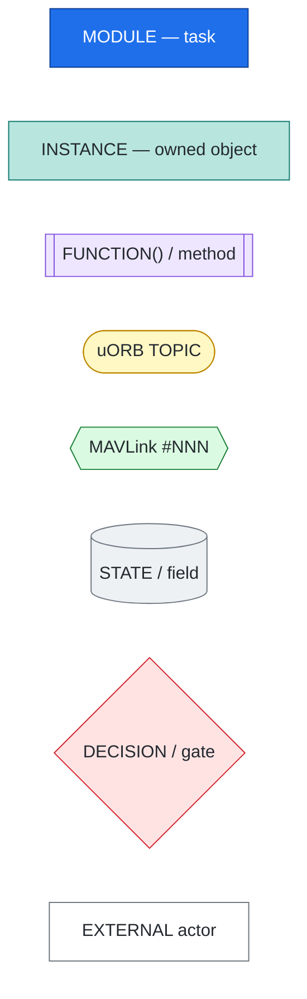
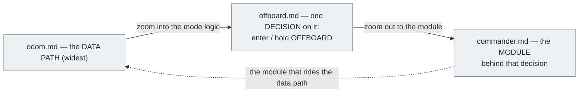
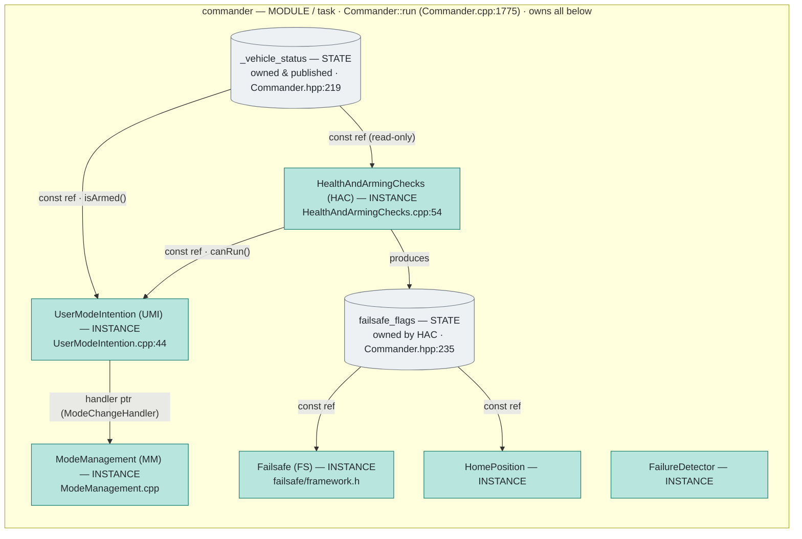
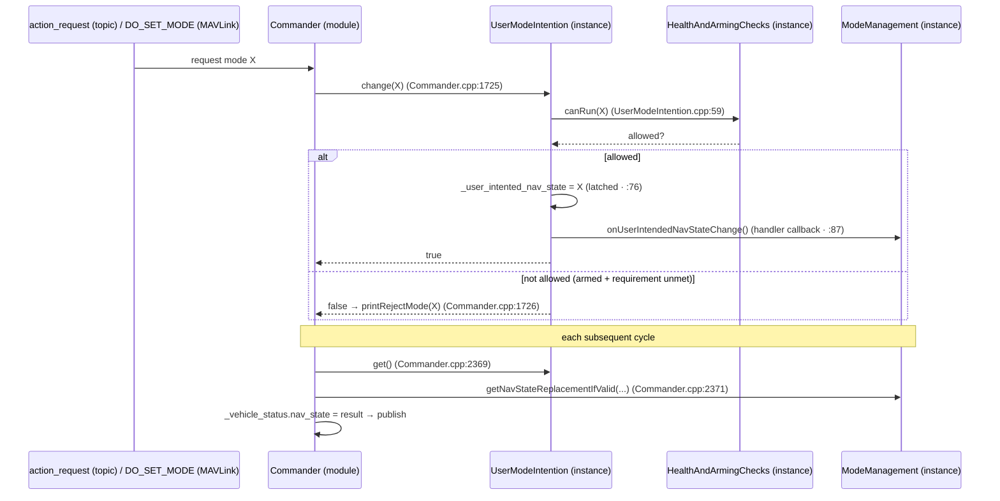

# commander.md — architecture of the `commander` module

`commander` is the vehicle's **supervisor**: it owns the authoritative vehicle state, decides
the **arming** status and the active **flight mode** (`nav_state`), runs all **health / arming
checks**, drives the **failsafe** state machine, and publishes the handful of topics the rest
of the stack obeys. This document maps its code architecture — the classes, who owns whom, and
how they talk — with a focus on the **`Commander` ↔ `UserModeIntention`** relationship.

Companion docs: [offboard.md](offboard.md) (the OFFBOARD decision in depth, with the
per-cycle call stack) and [odom.md](odom.md) (the data path). All citations are to the v1.17
tree as [`file:line`](src/...#Lline).

---

## Conventions: legend, vocabulary, and the three docs

These conventions are shared by all three docs ([odom.md](odom.md), [offboard.md](offboard.md),
**commander.md**). Whenever a diagram uses a color or shape, this is what it means.

### Diagram legend — every node is one of seven *kinds*

The distinction that matters most is **module vs instance vs function** — three different
things that all live "inside PX4" and are easy to confuse:

| Node (color · shape) | Kind | What it is in the code | How it talks to others | Example — *file · name* |
|---|---|---|---|---|
| **blue rectangle** | **MODULE** | a PX4 work-queue **task**: its own thread, one `run()`/`Run()`, registered via `ModuleBase` | **only via uORB topics** | `commander` — *Commander.cpp:1775 · `Commander::run`* ; also `mavlink_receiver`, `ekf2`, `mc_pos_control` |
| **teal rectangle** | **INSTANCE** | a C++ **object a module owns** as a member (composition); **not** its own task — runs inside the owner's loop | **direct method calls** | `UserModeIntention` — *Commander.hpp:233 · member `_user_mode_intention`* ; also `HealthAndArmingChecks`, `Failsafe` |
| **lavender subroutine** `[[ ]]` | **FUNCTION / METHOD** | one function or member-method call | called / returns | `executeActionRequest()` — *Commander.cpp:1651* ; `change()` — *UserModeIntention.cpp:44* |
| **yellow stadium** `([ ])` | **uORB TOPIC** | an in-RAM pub/sub message (`*_s` struct on a named bus) **between modules** | published / subscribed | `offboard_control_mode` , `vehicle_status` , `trajectory_setpoint` |
| **green hexagon** `{{ }}` | **MAVLINK MESSAGE** | a numbered message on the serial **wire** (companion ⇄ PX4) | sent / received | `#84 SET_POSITION_TARGET_LOCAL_NED` , `#331 ODOMETRY` |
| **grey cylinder** `[( )]` | **STATE / FIELD** | a variable or struct field in RAM (**not** a topic) | read / written | `_user_intented_nav_state` , `failsafe_flags.offboard_control_signal_lost` , the can-run bitmask |
| **red diamond** `{ }` | **DECISION / GATE** | a boolean test that branches the flow | true / false | `canRun(OFFBOARD)?` — *UserModeIntention.cpp:59* |
| **white/grey rectangle** | **EXTERNAL** | something outside PX4's module graph | — | `control_test` (companion) , RC ch7 (pilot) , motors |

The same eight kinds, rendered with their actual colors/shapes:



> **Why module ≠ instance ≠ function matters.** A **module** (`commander`) is scheduled
> independently and exchanges only **uORB topics** with other modules. An **instance**
> (`UserModeIntention`) has **no task of its own** — `commander` calls its methods inside
> `Commander::run()` and they share memory by reference. A **function** is a single call within
> that. So an arrow *between two modules* is a uORB publish; an arrow *between a module and its
> instance* (or instance↔instance) is a plain C++ method call. That is exactly why these are
> three separate docs: **odom.md** is modules+topics on the bus; **offboard.md** adds the
> functions/state/gate of one decision; **commander.md** opens up the **instances inside one
> module**.

### Vocabulary

| Term (· diagram shorthand) | Meaning |
|---|---|
| **module** | a PX4 work-queue task (own `run()`); inter-module comms = uORB only. |
| **instance** | an object a module owns as a member; shares the owner's thread; comms = direct method calls. |
| **owns / composition** | the module declares the instance as a member → controls its lifetime, holds it in its address space (the *composition root*, [Commander.hpp:219-236](src/modules/commander/Commander.hpp#L219)). |
| **`const ref`** (`const Foo &bar`) | a member that is a **read-only reference** to state **owned elsewhere** — read but not modify, no copy. This is how `commander` shares `_vehicle_status` and `failsafe_flags` with its instances: e.g. `UserModeIntention` holds a `const vehicle_status_s &` only to read `isArmed()`. |
| **`&handler` / interface seam** | passing a **pointer to an abstract base** (`ModeChangeHandler`) so an instance calls back into another without knowing its concrete type (`UserModeIntention` → `ModeManagement`). |
| **uORB topic** | named in-RAM pub/sub channel **between modules**. |
| **MAVLink `#NNN`** | a numbered message on the serial wire **between companion and PX4**. |
| **nav_state** | the active flight mode (enum field of `vehicle_status`), e.g. `NAVIGATION_STATE_OFFBOARD`. |
| **vehicle_control_mode** | commander's output of `flag_control_*` bits — *which controllers run*. |
| **latched** | state written once and re-read every cycle (vs. continuously streamed). |
| **gate** | a boolean precondition; OFFBOARD engages only on the **AND** of a *request* gate and a *heartbeat* gate (see [offboard.md](offboard.md)). |
| **heartbeat** | the `offboard_control_mode` topic, regenerated by every `#84` and freshness-checked. |
| **can-run / can-arm bitmask** | per-`nav_state` "is this mode allowed" bits produced by **HAC**; `canRun(x)` reads bit `x`. |
| **failsafe_flags** | the struct **HAC** fills (e.g. `offboard_control_signal_lost`); the inputs to **FS**. |
| **HAC · UMI · MM · FS** | diagram shorthand: **H**ealth**A**nd**A**rming**C**hecks · **U**ser**M**ode**I**ntention · **M**ode**M**anagement · **F**ail**S**afe. |
| **EV / external vision** | (odom) the off-board pose+velocity fed to `ekf2` via `vehicle_visual_odometry`. |
| **FRD / RDF** | (odom) axis conventions; the IPS world is RDF, the room frame is FRD. |

### The three documents and how they relate

They are three **zoom levels** on one system — the companion flying the vehicle through PX4:



| Doc | Scope | Answers | Node kinds it uses | Start here if… |
|---|---|---|---|---|
| [odom.md](odom.md) | the whole **data path**, companion ⇄ PX4 ⇄ motors | *what travels where* | module · topic · MAVLink · external | you're new to the project |
| [offboard.md](offboard.md) | one **decision**: how commander enters & holds OFFBOARD | *why is / isn't it in OFFBOARD* (two gates + per-cycle call stack) | **+ function · state · gate** | you're debugging mode / offboard |
| **commander.md** | the **module** that makes that decision | *how commander is built* (`Commander`↔`UserModeIntention`) | **+ instance** | you're changing commander code |

**Reading order** — new to the codebase: `odom → offboard → commander`; working *in*
commander: `commander → offboard → odom`. The thread tying them together is the
**`offboard_control_mode` heartbeat** and the **`nav_state`** it gates: odom produces the
heartbeat from `#84`, offboard shows it gating the OFFBOARD decision, commander shows the
instance (`UserModeIntention`) that latches the resulting mode.

---

## 1. The shape: one task, one loop, many collaborators

`Commander` is a single work-queue task and a parameter owner
([Commander.hpp:99](src/modules/commander/Commander.hpp#L99)):

```cpp
// src/modules/commander/Commander.hpp:99
class Commander : public ModuleBase<Commander>, public ModuleParams
{
    ...
    void run() override;          // the main loop (Commander.cpp:1775)
};
```

Architecturally it is a **facade / orchestrator**: it does not implement arming logic, check
logic, mode logic, or failsafe logic *inline*. Instead it **owns one instance of each
specialized collaborator** and wires them together by handing out references at construction.
The collaborators never reach for globals — they read the exact state `Commander` injected.

```cpp
// src/modules/commander/Commander.hpp:219-236  (the composition root)
vehicle_status_s        _vehicle_status{};                                   // 219  authoritative state (owned)

Failsafe                _failsafe_instance{this};                            // 221  failsafe state machine
FailsafeBase            &_failsafe{_failsafe_instance};                      // 222
FailureDetector         _failure_detector{this};                            // 223  in-air failure detection
HealthAndArmingChecks   _health_and_arming_checks{this, _vehicle_status};   // 224  runs all checks
Safety                  _safety{};                                          // 226  safety button
WorkerThread            _worker_thread{};                                   // 227  async/slow work (calibration…)
ModeManagement          _mode_management{ ... };                            // 228  external/replacement modes
UserModeIntention       _user_mode_intention {_vehicle_status,             // 233  latched user-intended mode
                            _health_and_arming_checks, &_mode_management};
const failsafe_flags_s  &_failsafe_flags{_health_and_arming_checks.failsafeFlags()}; // 235 checks' output (shared)
HomePosition            _home_position{_failsafe_flags};                    // 236
```

The single most important architectural fact is on those lines: **the constructor argument
lists *are* the dependency graph.** `UserModeIntention` is handed `_vehicle_status`,
`_health_and_arming_checks`, and `&_mode_management`; `_failsafe`/`_home_position` are handed
the `_failsafe_flags` that `_health_and_arming_checks` produces; and so on.

---

## 2. The dependency wiring (who holds a reference to whom)

Node kinds below (per the [Conventions legend](#conventions-legend-vocabulary-and-the-three-docs)):
**blue** = the `commander` **module**, **teal** = an **instance** it owns, **grey cylinder** =
**state**. Every edge is a plain C++ reference/call (not uORB — this is all *inside* one module).



Reading the edges: `_health_and_arming_checks` **produces** `failsafe_flags`; `_failsafe` and
`_home_position` **read** those flags; `_user_mode_intention` **reads** `_vehicle_status` and
**asks** `_health_and_arming_checks` whether a mode can run, and **notifies**
`_mode_management` of changes. `Commander` sits above all of them and runs the loop.

---

## 3. What flows in and out (uORB I/O)

All uORB I/O lives in `Commander` — the collaborators are pure in-memory objects. The
"headline" outputs are the three the whole control stack obeys: **`vehicle_status`**
(arming + nav_state + failsafe), **`vehicle_control_mode`** (the `flag_control_*` bits), and
**`actuator_armed`**.

| Direction | Topic | Purpose |
|---|---|---|
| **in** | `action_request` ([:292](src/modules/commander/Commander.hpp#L292)) | RC/stick/GCS mode + arm requests |
| in | `vehicle_command` ([:297](src/modules/commander/Commander.hpp#L297)) | MAVLink commands (`DO_SET_MODE`, arm, …) |
| in | `offboard_control_mode` ([:311](src/modules/commander/Commander.hpp#L311)) | the offboard heartbeat (see [offboard.md](offboard.md)) |
| in | `manual_control_setpoint`, `vehicle_land_detected`, `vtol_vehicle_status`, `mission_result`, `telemetry_status[]`, `system_power`, `power_button_state` | situational inputs for checks/failsafe |
| **out** | **`vehicle_status`** ([:320](src/modules/commander/Commander.hpp#L320)) | arming_state, **nav_state**, failsafe, valid-mode masks |
| **out** | **`vehicle_control_mode`** ([:319](src/modules/commander/Commander.hpp#L319)) | `flag_control_*` — which controllers run |
| **out** | **`actuator_armed`** ([:314](src/modules/commander/Commander.hpp#L314)) | armed / prearmed / lockdown / kill / termination |
| out | `vehicle_command_ack`, `vehicle_command`, `failure_detector_status`, `actuator_test` | acks + secondary outputs |

---

## 4. `Commander` ↔ `UserModeIntention` — the focused relationship

### 4.1 What `UserModeIntention` *is*

A tiny, I/O-free **policy + state object** that answers one question: *"what flight mode does
the user want, and is switching to it currently allowed?"* It holds exactly one piece of
durable state — the **latched** user-intended nav_state
([UserModeIntention.hpp:100](src/modules/commander/UserModeIntention.hpp#L100)):

```cpp
// src/modules/commander/UserModeIntention.hpp:100
uint8_t _user_intented_nav_state{vehicle_status_s::NAVIGATION_STATE_AUTO_LOITER};  // the latched intent
```

It touches **no uORB**. It depends only on the three references `Commander` injected at
construction ([Commander.hpp:233](src/modules/commander/Commander.hpp#L233)):

| Injected ref | Used for |
|---|---|
| `const vehicle_status_s &_vehicle_status` | `isArmed()` — disarmed ⇒ a change is always allowed |
| `const HealthAndArmingChecks &_health_and_arming_checks` | `canRun(nav_state)` — the validity gate |
| `ModeChangeHandler *_handler` (= `&_mode_management`) | callbacks on change / replacement / disarm |

### 4.2 The relationship is **ownership + delegation**

`Commander` *owns* the instance (plain member, composition — not a topic, not a task) and is
its only driver. The traffic between them is just method calls:

```
Commander  ──── writes ────▶  UserModeIntention.change(nav_state)      (request a mode)
Commander  ──── reads  ────▶  UserModeIntention.get()                  (each cycle → nav_state)
Commander  ──── reads  ────▶  UserModeIntention.onDisarm()             (latch reset on disarm)

UserModeIntention ── asks ──▶ HealthAndArmingChecks.canRun()           (is the mode allowed?)
UserModeIntention ── tells ─▶ ModeManagement (ModeChangeHandler)       (mode changed / replaced)
```

**Who calls `change()`** — every "I want a different mode" path in `Commander` funnels here:

| Caller in `Commander` | Trigger | Line |
|---|---|---|
| `executeActionRequest()` | RC ch7 / stick / action (`ACTION_SWITCH_MODE`) | [Commander.cpp:1725](src/modules/commander/Commander.cpp#L1725) |
| `handle_command()` | GCS `MAV_CMD_DO_SET_MODE` | [Commander.cpp:915](src/modules/commander/Commander.cpp#L915) |
| `handleModeIntentionAndFailsafe()` | failsafe overriding the user's intent | [Commander.cpp:2363](src/modules/commander/Commander.cpp#L2363) |

**Who reads `get()`** — once per cycle, to turn the latched intent into the published state
([Commander.cpp:2369-2372](src/modules/commander/Commander.cpp#L2369)):

```cpp
// src/modules/commander/Commander.cpp:2369
_vehicle_status.nav_state_user_intention = _mode_management.getNavStateReplacementIfValid(_user_mode_intention.get(), false);
_vehicle_status.nav_state = _mode_management.getNavStateReplacementIfValid(
                                FailsafeBase::modeFromAction(_failsafe.selectedAction(), _user_mode_intention.get()));
```

Note this line also shows **why the intent is latched, not streamed**: `Commander` re-derives
`nav_state` from `get()` *every* cycle, so a one-shot request (see
[offboard.md §1.4](offboard.md#14-the-request-is-one-shot-the-state-is-latched-in-commander))
keeps taking effect until something changes the intent or the failsafe overrides it.

### 4.3 The hand-off, end to end



### 4.4 The `ModeChangeHandler` seam

`UserModeIntention` does not know `ModeManagement` concretely — it knows only the abstract
`ModeChangeHandler` interface ([UserModeIntention.hpp:44](src/modules/commander/UserModeIntention.hpp#L44)):

```cpp
// src/modules/commander/UserModeIntention.hpp:44
class ModeChangeHandler {
public:
    virtual void    onUserIntendedNavStateChange(ModeChangeSource source, uint8_t nav_state) = 0;
    virtual uint8_t getReplacedModeIfAny(uint8_t nav_state) = 0;   // external→internal mode mapping
    virtual uint8_t onDisarm(uint8_t stored_nav_state) = 0;
};
```

`ModeManagement` implements it ([ModeManagement.hpp:129](src/modules/commander/ModeManagement.hpp#L129)),
and a stub no-op version exists for `CONSTRAINED_FLASH` builds
([ModeManagement.hpp:195](src/modules/commander/ModeManagement.hpp#L195)). That seam is what
lets `UserModeIntention` stay a small, unit-testable unit while still supporting
externally-registered (ROS2 / mode-executor) modes.

---

## 5. The other collaborators in one line each

| Collaborator | File | Responsibility |
|---|---|---|
| **HealthAndArmingChecks** | `HealthAndArmingChecks/` | runs a fixed array of `*Check` objects each cycle → fills `failsafe_flags` and the **can-run / can-arm** bitmasks. Owns the `failsafe_flags` everyone else reads. ([HealthAndArmingChecks.cpp:54](src/modules/commander/HealthAndArmingChecks/HealthAndArmingChecks.cpp#L54)) |
| **Failsafe** | `failsafe/` | state machine mapping `failsafe_flags` → a failsafe **Action**; `selectedAction()` ([framework.h:152](src/modules/commander/failsafe/framework.h#L152)) + `modeFromAction()` ([framework.h:154](src/modules/commander/failsafe/framework.h#L154)) override `nav_state` when needed. |
| **ModeManagement** | `ModeManagement.*` | external/replacement modes, mode executors, and the **valid / settable** nav-state masks; implements `ModeChangeHandler`. `getNavStateReplacementIfValid` ([:158](src/modules/commander/ModeManagement.hpp#L158)), `updateControlMode` ([:160](src/modules/commander/ModeManagement.hpp#L160)). |
| **UserModeIntention** | `UserModeIntention.*` | the latched user-intended mode + the change-allowed policy (§4). |
| **FailureDetector** | `failure_detector/` | detects in-air failures (attitude/△, ESC, …) → feeds a check. |
| **HomePosition** | `HomePosition.*` | establishes/holds the home position; reads `failsafe_flags`. |
| **Safety / WorkerThread / MulticopterThrowLaunch** | `Safety.*`, `worker_thread.*`, `MulticopterThrowLaunch/` | safety-button state, async slow work (calibration), throw-launch detection. |
| **ModeUtil** (free functions) | `ModeUtil/` | `getVehicleControlMode` ([control_mode.cpp](src/modules/commander/ModeUtil/control_mode.cpp)) + `mode_requirements` ([mode_requirements.cpp](src/modules/commander/ModeUtil/mode_requirements.cpp)) — pure mappings used by §6. |

---

## 6. The `run()` loop, at the architecture level

One cycle of `Commander::run()` ([Commander.cpp:1775](src/modules/commander/Commander.cpp#L1775))
is the orchestration that ties §4–§5 together. The detailed, line-by-line **call stack** is in
[offboard.md → "The call stack"](offboard.md#the-call-stack-one-commanderrun-cycle); the
architecture-level phases are:

```
1. INGEST          pull subscriptions, params, sub-checks (manual/offboard/datalink/battery…)
2. RESOLVE MODE    modeManagementUpdate(); handleModeIntentionAndFailsafe()
                   → _failsafe.update() + _user_mode_intention.get() → _vehicle_status.nav_state
3. RUN CHECKS      _health_and_arming_checks.update()   (≈10 Hz) → failsafe_flags + can-run/can-arm
4. APPLY REQUESTS  handle_command() / executeActionRequest() → _user_mode_intention.change(...)
                   arm()/disarm() transitions
5. PUBLISH         updateControlMode() → vehicle_control_mode;  vehicle_status;  actuator_armed
```

The ordering is deliberate (checks before requests so `change()` validates against fresh
verdicts; see [offboard.md](offboard.md#why-the-order-matters-it-is-not-arbitrary)).

---

## 7. Module file / directory map

```
src/modules/commander/
├── Commander.{hpp,cpp} ........ the orchestrator + run() loop  (this doc, §1–§6)
├── UserModeIntention.{hpp,cpp}  latched user mode + change policy  (§4)
├── ModeManagement.{hpp,cpp} ... external/replacement modes, valid-mode masks
├── HomePosition.{hpp,cpp} ..... home position
├── Safety.{hpp,cpp} ........... safety button
├── worker_thread.{hpp,cpp} .... async slow work
├── *_calibration.cpp, commander_helper.cpp, calibration_routines.cpp …  (sensor cal, helpers)
├── Arming/ .................... arm authorization
├── failsafe/ ................. failsafe state machine (framework.h, failsafe.{h,cpp})
├── failure_detector/ ......... in-air failure detection
├── HealthAndArmingChecks/
│   ├── HealthAndArmingChecks.{hpp,cpp}   the check runner + _checks[] array
│   └── checks/  .............. ~30 individual checks (offboardCheck, modeCheck, estimatorCheck…)
├── ModeUtil/ ................. control_mode.cpp, mode_requirements.cpp (pure mappings)
└── MulticopterThrowLaunch/ ... throw-to-launch detection
```

---

## 8. One-paragraph summary

`Commander` is a single work-queue **task** that owns the authoritative `vehicle_status` and
composes a set of focused collaborators — `HealthAndArmingChecks` (produces `failsafe_flags`
and can-run/can-arm verdicts), `Failsafe` (turns those into a mode override), `ModeManagement`
(external/replacement modes), `HomePosition`, `FailureDetector`, and **`UserModeIntention`** —
wiring them together with shared references at construction. `UserModeIntention` is the small,
I/O-free unit that **latches the user's intended flight mode** and decides whether a change is
allowed by asking `HealthAndArmingChecks.canRun()`; `Commander` *drives* it (`change()` on
every request path, `get()` every cycle to produce `nav_state`) and `UserModeIntention`
*delegates* to `ModeManagement` through the `ModeChangeHandler` seam. Each `run()` cycle the
orchestrator ingests inputs, resolves mode + failsafe, runs the checks, applies arm/mode
requests, and publishes `vehicle_status` / `vehicle_control_mode` / `actuator_armed`.
