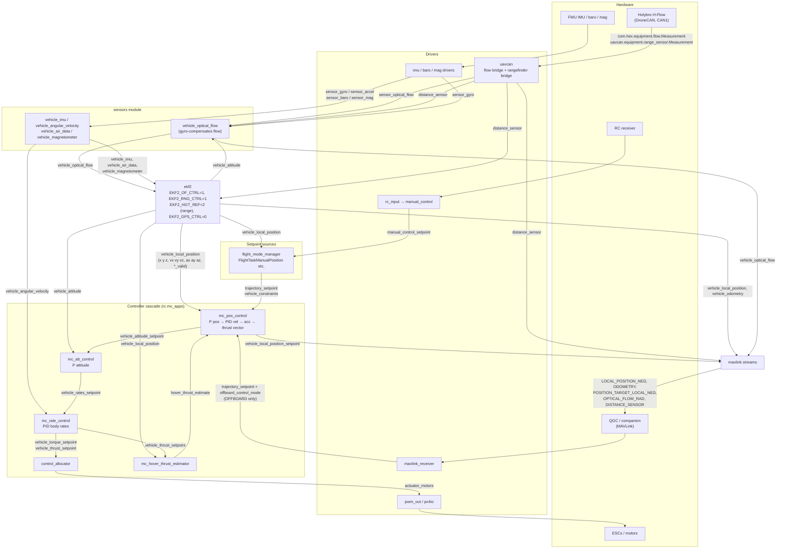

# hflow_dataflow.md — H-Flow build: module/topic diagram and the position controller

What runs in `px4_fmu-v5_default` with [`hflow.params`](hflow.params)
applied, how the modules are wired through uORB, and what `mc_pos_control` does
with the estimate. Every module and topic name is taken from the v1.17 source in
this tree (paths cited inline).

---

## 1. Diagram of the current configuration



Not drawn: `commander` (publishes `vehicle_control_mode`, which every controller
reads to know whether it is active), `land_detector` (`vehicle_land_detected`),
`navigator` (auto modes feed `flight_mode_manager`, not `mc_pos_control` directly).

---

## 2. Where the H-Flow data goes

| Step | Module / file | In | Out |
|---|---|---|---|
| CAN frames → uORB | `src/drivers/uavcan/sensors/flow.cpp`, `rangefinder.cpp` | DroneCAN flow + range messages | `sensor_optical_flow`, `distance_sensor` |
| Gyro compensation, rotation (`SENS_FLOW_ROT`), height window (`SENS_FLOW_MINHGT/MAXHGT`), rate limit (`SENS_FLOW_MAXR`) | `src/modules/sensors/vehicle_optical_flow/VehicleOpticalFlow.cpp` | `sensor_optical_flow`, `sensor_gyro`, `distance_sensor`, `vehicle_attitude` | `vehicle_optical_flow` |
| Fusion | `src/modules/ekf2/EKF2.cpp` | `vehicle_optical_flow`, `distance_sensor`, `vehicle_imu`, `vehicle_air_data`, `vehicle_magnetometer` | `vehicle_local_position`, `vehicle_attitude`, `vehicle_odometry`, `estimator_status` |

The H-Flow's own gyro integral is passed through when present
(`VehicleOpticalFlow.cpp:129`), otherwise the FMU gyro is integrated over the
flow interval. The third `delta_angle` element is always NaN because the CAN
message only carries X and Y (`flow.cpp:82`).

EKF2 turns flow (rad of line-of-sight motion) into body velocity using the height
above ground from the rangefinder, and fuses that as a velocity measurement.
Consequences with this param set:

- `vx, vy` are measured (flow × height). Good.
- `x, y` are only the integral of velocity. They drift slowly and reset to 0
  wherever fusion starts. There is no absolute position source until the IPS
  external-vision stream is added (`EKF2_EV_CTRL`).
- `z` comes from the rangefinder (`EKF2_HGT_REF=2`), so it is height above the
  floor, negative up. Over a step or table the origin moves with the floor.
- Flow fusion stops if range is invalid, height is outside the flow window, or
  quality drops below `EKF2_OF_QMIN` (air) / `EKF2_OF_QMIN_GND` (ground).

---

## 3. The position controller

Module `mc_pos_control` (`src/modules/mc_pos_control/MulticopterPositionControl.cpp`)
wraps the library `PositionControl` (`PositionControl/PositionControl.cpp`).
It is started by `ROMFS/px4fmu_common/init.d/rc.mc_apps` after
`control_allocator`, `mc_rate_control`, `mc_att_control`,
`mc_hover_thrust_estimator` and `flight_mode_manager`.

**It never reads a sensor.** Its only state input is `vehicle_local_position`
from EKF2. Its only command input is `trajectory_setpoint`.

### Cascade (runs once per `vehicle_local_position` update)

```
trajectory_setpoint (pos / vel / acc / yaw, NaN = "not commanded")
        │
        ▼
  P position   vel_sp = (pos_sp - pos) * MPC_XY_P / MPC_Z_P        PositionControl.cpp:124
        │        + feed-forward velocity from the setpoint
        ▼
  PID velocity acc_sp = (vel_sp - vel) * MPC_XY_VEL_P_ACC           PositionControl.cpp:140
        │             + integral      * MPC_XY_VEL_I_ACC
        │             - vel_dot       * MPC_XY_VEL_D_ACC   (vel_dot = ax ay az from EKF)
        │        (Z uses MPC_Z_VEL_*_ACC)
        ▼
  acceleration → thrust vector   thr = acc / g * hover_thrust  (hover_thrust_estimate)
        │                        limited by MPC_THR_MIN/MAX, MPC_TILTMAX_AIR
        ▼
  thrust vector + yaw_sp  →  vehicle_attitude_setpoint (quaternion + thrust_body)
        │
        ▼
  mc_att_control (P on attitude error, MC_ROLL_P / MC_PITCH_P / MC_YAW_P)
        │  vehicle_rates_setpoint
        ▼
  mc_rate_control (PID on vehicle_angular_velocity, MC_*RATE_P/I/D)
        │  vehicle_torque_setpoint + vehicle_thrust_setpoint
        ▼
  control_allocator → actuator_motors → pwm_out
```

Any NaN element in the setpoint or the state simply drops out of the sum
(`ControlMath::addIfNotNanVector3f`). That is how one controller serves
Altitude mode (only Z position is closed, XY receives a velocity setpoint from
the sticks), Position mode (all three closed), and Offboard velocity setpoints
(position terms NaN, velocity PID only).

### Default gains (`mc_pos_control_params.c`)

| Loop | XY | Z |
|---|---|---|
| Position P (1/s) | `MPC_XY_P` 0.95 | `MPC_Z_P` 1.0 |
| Velocity P (m/s² per m/s) | `MPC_XY_VEL_P_ACC` 1.8 | `MPC_Z_VEL_P_ACC` 4.0 |
| Velocity I | `MPC_XY_VEL_I_ACC` 0.4 | `MPC_Z_VEL_I_ACC` 2.0 |
| Velocity D | `MPC_XY_VEL_D_ACC` 0.2 | `MPC_Z_VEL_D_ACC` 0.0 |

With flow as the only horizontal source the ARK Flow docs suggest lowering
`MPC_XY_P` to about 0.5 to avoid oscillation, because the position estimate is
noisier and drifts.

### Which modes go through it

| Mode | Setpoint producer | What `mc_pos_control` closes |
|---|---|---|
| Stabilized, Acro, Manual | none (bypassed) | nothing; sticks go straight to `mc_att_control` / `mc_rate_control` |
| Altitude | `FlightTaskManualAltitude` | Z position, XY velocity from sticks |
| Position, Hold | `FlightTaskManualPosition`, `FlightTaskAuto*` | X Y Z position + yaw |
| Takeoff, Land, Return, Mission | `navigator` → `FlightTaskAuto*` | X Y Z position + yaw |
| Offboard | `mavlink_receiver` → `trajectory_setpoint` | whichever fields the companion sends non-NaN |

Position mode will refuse to arm or will drop to Altitude mode if
`vehicle_local_position.xy_valid` / `v_xy_valid` are false, which is what the
"flow fusion started" check in [`README.md`](README.md) is for.

---

## 4. uORB names to remember

| Meaning | Topic | Fields |
|---|---|---|
| Estimated state (what the controller uses) | `vehicle_local_position` | `x y z` (m, NED, z down), `vx vy vz` (m/s), `ax ay az`, `heading`, `xy_valid z_valid v_xy_valid v_z_valid`, `dist_bottom` |
| Same, quaternion + covariances | `vehicle_odometry` | `position[3] velocity[3] q[4]` |
| Attitude | `vehicle_attitude` | `q[4]` |
| Commanded trajectory (input to pos control) | `trajectory_setpoint` | `position[3] velocity[3] acceleration[3] yaw yawspeed`, NaN = not commanded |
| What pos control actually tracked (output/log) | `vehicle_local_position_setpoint` | `x y z vx vy vz acceleration thrust` |
| Output to attitude loop | `vehicle_attitude_setpoint` | `q_d[4] thrust_body[3] yaw_sp_move_rate` |
| Output to rate loop | `vehicle_rates_setpoint` | `roll pitch yaw thrust_body` |
| Raw H-Flow | `sensor_optical_flow`, `distance_sensor` | `pixel_flow[2] delta_angle[3] quality`, `current_distance` |
| Compensated flow into EKF | `vehicle_optical_flow` | `pixel_flow[2] delta_angle[3] distance_m quality` |

MAVLink equivalents seen in QGC's MAVLink Inspector:
`LOCAL_POSITION_NED` ← `vehicle_local_position`,
`ODOMETRY` ← `vehicle_odometry`,
`POSITION_TARGET_LOCAL_NED` ← `vehicle_local_position_setpoint` (NaN outside
position-controlled modes, which is why it read NaN on the bench),
`OPTICAL_FLOW_RAD` ← `vehicle_optical_flow`, `DISTANCE_SENSOR` ← `distance_sensor`.

---

## 5. Watching the cascade live (nsh)

```
listener vehicle_local_position 5 200      # state in
listener trajectory_setpoint               # command in (only in Alt/Pos/Offboard)
listener vehicle_local_position_setpoint   # what the P/PID loops produced
listener vehicle_attitude_setpoint         # tilt + thrust handed to mc_att_control
listener vehicle_rates_setpoint            # handed to mc_rate_control
ekf2 status                                # which aiding sources are active
```
