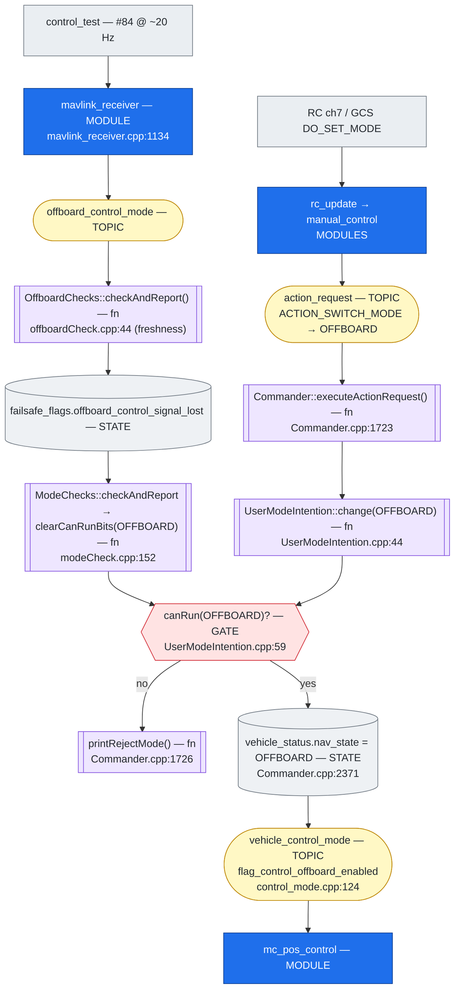
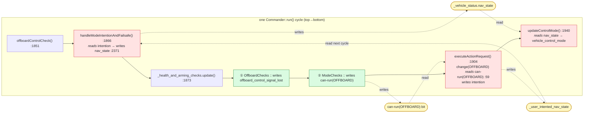
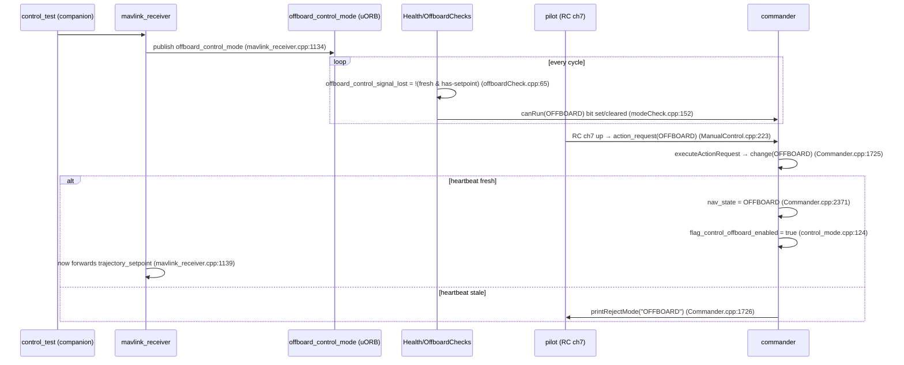

# offboard.md — how PX4 *enters* and *holds* OFFBOARD (commander internals)

A deep, line-cited walk through the firmware logic that decides whether the vehicle is in
**OFFBOARD** mode. This is the zoom-in on [odom.md §3](odom.md#3-entering-offboard-the-rc-mode-switch-channel-7): odom.md shows the
data path; this shows the **decision** inside `commander`.

Everything is cited to the v1.17 firmware in this tree as
[`file.cpp:line`](src/...#Lline) so it can be opened and verified.

---

## The one idea: OFFBOARD is an **AND of two independent gates**

OFFBOARD is *never* enabled by a single message. Two things, produced by two different
actors and checked in two different files, must be true **at the same time**:

| Gate | Who produces it | What it means | Checked in |
|---|---|---|---|
| **① REQUEST** — "put me in OFFBOARD" | the **pilot** (RC ch7) or a GCS `DO_SET_MODE` | someone *asked* for the mode | `Commander.cpp` (action_request) |
| **② PRECONDITION** — "a companion is actively commanding" | the **companion** (`control_test`'s `#84` stream → `offboard_control_mode`) | the offboard *signal* is live & fresh | `offboardCheck.cpp` (freshness) |

The two gates meet in exactly one place — **`UserModeIntention::change()`**, which only
flips the mode if `canRun(OFFBOARD)` is true, and `canRun` is false whenever gate ② is
stale. Miss either gate and OFFBOARD does not engage (or, in flight, it drops to failsafe).

```
   GATE ① REQUEST                              GATE ② PRECONDITION (heartbeat)
   ──────────────                              ──────────────────────────────
   RC ch7 (or GCS)                             control_test  ──#84──▶  mavlink_receiver
        │                                                                   │
        │ rc_update → manual_control                                        │ publishes
        ▼                                                                   ▼
   uORB: action_request                                          uORB: offboard_control_mode
        │ (ACTION_SWITCH_MODE → OFFBOARD)                                   │
        ▼                                                                   ▼
   Commander::executeActionRequest()                            OffboardChecks::checkAndReport()
        │  Commander.cpp:1723                                    │  offboardCheck.cpp:44 (freshness)
        ▼                                                        ▼
   _user_mode_intention.change(OFFBOARD) ──────┐    failsafe_flags.offboard_control_signal_lost
        UserModeIntention.cpp:44               │                 │
                                               │                 ▼  modeCheck.cpp:152
                                               │    clearCanRunBits(OFFBOARD)  ← removes OFFBOARD
                                               │                 │              from the "can run" set
                                               ▼                 │
                              canRun(OFFBOARD)? ◀────────────────┘
                              UserModeIntention.cpp:59
                                    │
                          allowed ──┴── rejected → printRejectMode() (Commander.cpp:1726)
                              │
                              ▼
              _vehicle_status.nav_state = NAVIGATION_STATE_OFFBOARD   (Commander.cpp:2371)
              _vehicle_control_mode.flag_control_offboard_enabled = true (control_mode.cpp:124)
                              │
                              ▼
                     mc_pos_control acts on trajectory_setpoint
```



> **Legend** — blue = **module** · lavender `[[ ]]` = **function/method** · yellow `([ ])` =
> **uORB topic** · grey cylinder `[( )]` = **state/field** · red = **decision/gate** · plain
> grey = **external**. Full legend + vocabulary + how this relates to odom.md & commander.md:
> [commander.md → Conventions](commander.md#conventions-legend-vocabulary-and-the-three-docs).

---

## The call stack: one `Commander::run()` cycle

The flowchart above is *dataflow*. This is the **call hierarchy**: everything below happens
inside a single iteration of the commander work-queue task `Commander::run()`
([Commander.cpp:1775](src/modules/commander/Commander.cpp#L1775)). Indentation = call depth;
the right column is `file:line`. The two gates from above are marked **①** (heartbeat) and
**②** (request).

```
Commander::run()                                              Commander.cpp:1775   ← work-queue callback, every cycle
│
├─ offboardControlCheck()                                     :1851
│    └─ _offboard_control_mode_sub.update()                   :2985   if a fresh #84 arrived while signal was lost,
│                                                                     set _status_changed → force an immediate re-check
│
├─ modeManagementUpdate()                                     :1862
│
├─ handleModeIntentionAndFailsafe()                           :1866   (def :2339)  ← APPLIES intention → nav_state
│    ├─ _failsafe.update(…)                                   :2356   choose a failsafe action if a requirement is unmet
│    ├─ _user_mode_intention.change(mode, …, force=true)      :2363   failsafe may OVERRIDE the user's intent
│    └─ _vehicle_status.nav_state =                           :2371   ← the nav_state the whole system sees
│         _mode_management.getNavStateReplacementIfValid(
│             FailsafeBase::modeFromAction(action, intent))
│
├─ _health_and_arming_checks.update()      [≈10 Hz gate, :1869]  :1873   (def HealthAndArmingChecks.cpp:54)
│    └─ for each check: _checks[i]->checkAndReport()          HealthAndArmingChecks.cpp:70
│         ├─ ①  OffboardChecks::checkAndReport()              offboardCheck.cpp:38
│         │       └─ failsafe_flags.offboard_control_signal_lost          :65
│         │            = !(fresh < COM_OF_LOSS_T  &&  has-setpoint  &&  estimate-valid)
│         └─ ②  ModeChecks::checkAndReport()                  modeCheck.cpp:36
│                 (runs AFTER ① — enforced by _checks[] order, HealthAndArmingChecks.hpp:187)
│                 └─ if offboard_control_signal_lost:
│                      clearCanRunBits(OFFBOARD)              modeCheck.cpp:152   ← drops OFFBOARD from "can run"
│
├─ if (_action_request_sub.updated())                        :1904   ← RC ch7 / GCS request lands here
│    └─ executeActionRequest(action_request)                 :1913   (def :1651)
│         └─ case ACTION_SWITCH_MODE:                         :1723
│              └─ _user_mode_intention.change(OFFBOARD)       :1725   (def UserModeIntention.cpp:44)
│                   ├─ if armed: allow = canRun(OFFBOARD)     UserModeIntention.cpp:59
│                   │       └─ _reporter.canRun(nav_state)    HealthAndArmingChecks.hpp:102  ← reads the bit ② just set
│                   ├─ allow ⇒ _user_intented_nav_state = OFFBOARD   (becomes nav_state NEXT cycle, at :2371)
│                   └─ !allow ⇒ return false ⇒ printRejectMode()     :1726
│
└─ if (publish tick)  updateControlMode()                    :1940   (def :2600)
     └─ mode_util::getVehicleControlMode(nav_state, …, offboard_control_mode, vcm)   :2604
     │    └─ case NAVIGATION_STATE_OFFBOARD:                 control_mode.cpp:123
     │         flag_control_offboard_enabled = true  +  pos/vel/att flags from #84 bits   :124
     └─ _vehicle_control_mode_pub.publish(vcm)               :2617
```

### Why the order matters (it is not arbitrary)

- **① before ②, same `update()`.** `OffboardChecks` writes `offboard_control_signal_lost`;
  `ModeChecks` reads it to clear OFFBOARD's can-run bit. The firmware pins this ordering in
  the `_checks[]` array and even comments it: `_mode_checks` *"must be after … _offboard_checks"*
  ([HealthAndArmingChecks.hpp:187](src/modules/commander/HealthAndArmingChecks/HealthAndArmingChecks.hpp#L187)).
- **Checks (1873) before request (1904).** So when the pilot's request reaches
  `change()` → `canRun(OFFBOARD)` ([UserModeIntention.cpp:59](src/modules/commander/UserModeIntention.cpp#L59)),
  it reads a can-run bit computed earlier *in the same cycle*. Accept/reject is decided on
  up-to-date heartbeat state — no extra round-trip.

### The one-cycle latency (worth knowing when reading logs)

`change()` updates only the **intention** (`_user_intented_nav_state`); it does **not**
write `_vehicle_status.nav_state`. That write lives in `handleModeIntentionAndFailsafe()`
at [:2371](src/modules/commander/Commander.cpp#L2371) — which already ran *earlier* this
cycle (:1866). So a freshly-accepted OFFBOARD intention is published as `nav_state` (and the
`flag_control_offboard_enabled` derived from it) on the **next** `run()` iteration:

```
cycle N    : request → change(OFFBOARD) accepted → intention = OFFBOARD
cycle N+1  : handleModeIntentionAndFailsafe → nav_state = OFFBOARD → updateControlMode → flag_control_offboard_enabled
```

At the loop's tens-of-Hz rate this is sub-100 ms — invisible in flight, but it explains why
the `nav_state` transition in a log trails the `action_request` by one tick.

> **Note — this next diagram uses a *local* coloring, not the shared legend.** Here the colors
> mark **data-dependency roles** within the cycle: green = *writes* shared state, red = *reads*
> it, yellow = the shared **state/field** itself. (Elsewhere green/red/yellow mean
> MAVLink/gate/topic — see [Conventions](commander.md#conventions-legend-vocabulary-and-the-three-docs).)



---

## Part ① — The REQUEST: how a "switch to OFFBOARD" reaches commander

### 1.1 RC channel 7 → `action_request` (outside commander)

Covered in detail in [odom.md §3](odom.md#3-entering-offboard-the-rc-mode-switch-channel-7); the short version of the two hops that
happen *before* commander sees anything:

- **rc_update** binds the channel and thresholds it into a switch
  ([rc_update.cpp:200](src/modules/rc_update/rc_update.cpp#L200),
  [:622](src/modules/rc_update/rc_update.cpp#L622)), publishing `manual_control_switches`.
- **manual_control** turns a switch *edge* into a mode request
  ([ManualControl.cpp:221](src/modules/manual_control/ManualControl.cpp#L221)):

```cpp
// src/modules/manual_control/ManualControl.cpp:221
if (switches.offboard_switch != _previous_switches.offboard_switch) {
    if (switches.offboard_switch == manual_control_switches_s::SWITCH_POS_ON) {
        sendActionRequest(action_request_s::ACTION_SWITCH_MODE, action_request_s::SOURCE_RC_SWITCH,
                          vehicle_status_s::NAVIGATION_STATE_OFFBOARD);   // ← the request
    } else if (switches.offboard_switch == manual_control_switches_s::SWITCH_POS_OFF) {
        evaluateModeSlot(switches.mode_slot);                            // ← back to manual/slot
    }
}
```

`sendActionRequest` just packs and publishes the `action_request` uORB topic
([ManualControl.cpp:446](src/modules/manual_control/ManualControl.cpp#L446)):

```cpp
// src/modules/manual_control/ManualControl.cpp:446
void ManualControl::sendActionRequest(int8_t action, int8_t source, int8_t mode)
{
    action_request_s action_request{};
    action_request.action = action;   // ACTION_SWITCH_MODE
    action_request.source = source;   // SOURCE_RC_SWITCH
    action_request.mode   = mode;     // NAVIGATION_STATE_OFFBOARD
    action_request.timestamp = hrt_absolute_time();
    _action_request_pub.publish(action_request);
}
```

> **commander never reads the RC switch directly.** Its only knowledge of "the pilot wants
> OFFBOARD" is this `action_request` topic. A GCS reaches the same outcome via
> `MAV_CMD_DO_SET_MODE`, handled in `handle_command()` and ending at the same
> `_user_mode_intention.change(...)` call ([Commander.cpp:915](src/modules/commander/Commander.cpp#L915)).

### 1.2 commander consumes `action_request`

In the main run loop, commander drains the topic and dispatches it
([Commander.cpp:1904](src/modules/commander/Commander.cpp#L1904)):

```cpp
// src/modules/commander/Commander.cpp:1904
if (_action_request_sub.updated()) {
    action_request_s action_request;
    if (_action_request_sub.copy(&action_request)) {
        ...
        executeActionRequest(action_request);          // Commander.cpp:1913
    }
}
```

### 1.3 `ACTION_SWITCH_MODE` → request the mode

Inside `executeActionRequest`, the `ACTION_SWITCH_MODE` case is the entire "enter a mode"
mechanism ([Commander.cpp:1723](src/modules/commander/Commander.cpp#L1723)):

```cpp
// src/modules/commander/Commander.cpp:1723
case action_request_s::ACTION_SWITCH_MODE:
    if (!_user_mode_intention.change(action_request.mode, ModeChangeSource::User, false)) {
        printRejectMode(action_request.mode);    // ← rejected (e.g. heartbeat missing)
    }
    break;
```

`action_request.mode` is `NAVIGATION_STATE_OFFBOARD`. Note the request can be **rejected**
right here — that is gate ② saying "no" (see Part ③). The rejection is throttled and
surfaced to the GCS by `printRejectMode` ([Commander.cpp:2620](src/modules/commander/Commander.cpp#L2620)).

---

### 1.4 The request is one-shot; the state is latched in commander

`manual_control` fires the `action_request` **only on the switch edge**, not continuously.
A per-switch block runs only when a new `manual_control_switches` sample arrives *and* its
value differs from the remembered previous one
([ManualControl.cpp:221](src/modules/manual_control/ManualControl.cpp#L221)); the sample is
then stored as the new baseline ([ManualControl.cpp:298](src/modules/manual_control/ManualControl.cpp#L298)):

```cpp
// src/modules/manual_control/ManualControl.cpp:221, :298
if (switches.offboard_switch != _previous_switches.offboard_switch) { ... sendActionRequest(...); }
...
_previous_switches = switches;   // ← edge baseline; holding ch7 up sends nothing more
```

So holding ch7 up emits exactly **one** `action_request`. What keeps you in OFFBOARD
afterwards is not a stream of requests — it is the **latched intention** inside commander:

```cpp
// src/modules/commander/UserModeIntention.cpp:76  (inside change())
_user_intented_nav_state = user_intended_nav_state;   // OFFBOARD, stored as a plain member
// src/modules/commander/UserModeIntention.hpp:100
uint8_t _user_intented_nav_state{...};                // ← the saved state, persists across cycles
```

Every cycle `handleModeIntentionAndFailsafe()` reads it back via `_user_mode_intention.get()`
and (re)derives the published `nav_state` from it
([Commander.cpp:2371](src/modules/commander/Commander.cpp#L2371)).

This is the deliberate asymmetry between the two gates:

| | Mode REQUEST (gate ①) | Heartbeat (gate ②) |
|---|---|---|
| Cadence | **one-shot**, on the ch7 edge | **continuous**, every `#84` |
| Stored as | latched `_user_intented_nav_state` (commander) | a freshness *timestamp*, re-checked each cycle |
| If it stops | nothing changes — intention stays OFFBOARD | goes stale → failsafe overrides `nav_state` |

Because the intention is latched, a *transient* heartbeat loss that later recovers
re-engages OFFBOARD **without** re-toggling ch7: `offboardControlCheck()` forces a re-check
when a fresh `#84` returns ([Commander.cpp:2985](src/modules/commander/Commander.cpp#L2985)),
`canRun(OFFBOARD)` passes again, and `handleModeIntentionAndFailsafe()` re-applies the still-
latched OFFBOARD intent. (Exception: certain failsafe *actions* overwrite the intention at
[Commander.cpp:2363](src/modules/commander/Commander.cpp#L2363) — then it will not
auto-return and the pilot must re-request.)

---

## Part ② — The PRECONDITION: the `offboard_control_mode` heartbeat

### 2.1 `#84` becomes `offboard_control_mode` (in mavlink_receiver)

Every `SET_POSITION_TARGET_LOCAL_NED` (`#84`) the companion streams regenerates the
heartbeat topic. There is **no** `OFFBOARD_CONTROL_MODE` MAVLink message — the topic is
synthesized from the `#84`'s `type_mask`
([mavlink_receiver.cpp:1119](src/modules/mavlink/mavlink_receiver.cpp#L1119)):

```cpp
// src/modules/mavlink/mavlink_receiver.cpp:1119
offboard_control_mode_s ocm{};
ocm.position     = !matrix::Vector3f(setpoint.position).isAllNan();
ocm.velocity     = !matrix::Vector3f(setpoint.velocity).isAllNan();
ocm.acceleration = !matrix::Vector3f(setpoint.acceleration).isAllNan();
...
if (ocm.position || ocm.velocity || ocm.acceleration) {
    ocm.timestamp = hrt_absolute_time();
    _offboard_control_mode_pub.publish(ocm);            // mavlink_receiver.cpp:1134

    vehicle_status_s vehicle_status{};
    _vehicle_status_sub.copy(&vehicle_status);
    if (vehicle_status.nav_state == vehicle_status_s::NAVIGATION_STATE_OFFBOARD) {
        setpoint.timestamp = hrt_absolute_time();
        _trajectory_setpoint_pub.publish(setpoint);     // ← only forwarded once IN offboard
    }
}
```

Two facts to carry forward:
- The **`ocm.timestamp`** is the freshness clock gate ② reads.
- The **`trajectory_setpoint`** is only published once `nav_state == OFFBOARD`
  ([mavlink_receiver.cpp:1139](src/modules/mavlink/mavlink_receiver.cpp#L1139)). Before
  entry, the `#84` stream serves *only* as the heartbeat.

### 2.2 The freshness test — `OffboardChecks`

This is the literal "is the offboard signal alive?" check. It is **not** in `Commander.cpp`
— it lives in commander's HealthAndArmingChecks submodule
([offboardCheck.cpp:38](src/modules/commander/HealthAndArmingChecks/checks/offboardCheck.cpp#L38)):

```cpp
// src/modules/commander/HealthAndArmingChecks/checks/offboardCheck.cpp:40
reporter.failsafeFlags().offboard_control_signal_lost = true;          // pessimistic default

offboard_control_mode_s offboard_control_mode;
if (_offboard_control_mode_sub.copy(&offboard_control_mode)) {

    bool data_is_recent = hrt_absolute_time() < offboard_control_mode.timestamp
                          + static_cast<hrt_abstime>(_param_com_of_loss_t.get() * 1_s);   // < COM_OF_LOSS_T

    bool offboard_available = (offboard_control_mode.position || offboard_control_mode.velocity
                               || offboard_control_mode.acceleration || offboard_control_mode.attitude
                               || offboard_control_mode.body_rate || offboard_control_mode.thrust_and_torque
                               || offboard_control_mode.direct_actuator) && data_is_recent;

    if (offboard_control_mode.position && reporter.failsafeFlags().local_position_invalid) {
        offboard_available = false;        // position offboard also needs a valid local position
    } else if (offboard_control_mode.velocity && reporter.failsafeFlags().local_velocity_invalid) {
        offboard_available = false;
    } ...

    reporter.failsafeFlags().offboard_control_signal_lost = !offboard_available;          // offboardCheck.cpp:65
}
```

So `offboard_control_signal_lost` is **false** (good) only if all of:
1. a heartbeat exists, **and**
2. it is newer than `COM_OF_LOSS_T` (default 1 s), **and**
3. it carries at least one setpoint bit, **and**
4. the matching estimate is valid (e.g. position offboard needs a valid `vehicle_local_position`).

For our Phase-1 position setpoints this also ties back to [odom.md §6](odom.md#6-gotcha-it-only-works-once-yaw-is-aligned): if
ekf2 has no fused position, `local_position_invalid` is true and OFFBOARD is *still*
blocked even though the heartbeat itself is fresh.

### 2.3 From "signal lost" to a hard **mode requirement**

OFFBOARD is declared to *require* the offboard signal
([mode_requirements.cpp:155](src/modules/commander/ModeUtil/mode_requirements.cpp#L155)):

```cpp
// src/modules/commander/ModeUtil/mode_requirements.cpp:155
// NAVIGATION_STATE_OFFBOARD
setRequirement(vehicle_status_s::NAVIGATION_STATE_OFFBOARD, flags.mode_req_angular_velocity);
setRequirement(vehicle_status_s::NAVIGATION_STATE_OFFBOARD, flags.mode_req_attitude);
setRequirement(vehicle_status_s::NAVIGATION_STATE_OFFBOARD, flags.mode_req_offboard_signal);   // ← here
```

and the mode check enforces it by **removing OFFBOARD from the "can run" set** whenever the
signal is lost ([modeCheck.cpp:144](src/modules/commander/HealthAndArmingChecks/checks/modeCheck.cpp#L144)):

```cpp
// src/modules/commander/HealthAndArmingChecks/checks/modeCheck.cpp:144
if (reporter.failsafeFlags().offboard_control_signal_lost && reporter.failsafeFlags().mode_req_offboard_signal != 0) {
    reporter.armingCheckFailure(..., events::Log::Error, "No offboard signal");
    reporter.clearCanRunBits((NavModes)reporter.failsafeFlags().mode_req_offboard_signal);   // ← OFFBOARD can no longer run
}
```

`clearCanRunBits` is the bridge to Part ③: it makes `canRun(OFFBOARD)` return false.

---

## Part ③ — Where the two gates meet: `UserModeIntention::change()`

Both gates converge here. The request from Part ① calls `change()`; the precondition from
Part ② has (or hasn't) cleared OFFBOARD's can-run bit
([UserModeIntention.cpp:44](src/modules/commander/UserModeIntention.cpp#L44)):

```cpp
// src/modules/commander/UserModeIntention.cpp:44
bool UserModeIntention::change(uint8_t user_intended_nav_state, ModeChangeSource source,
                               bool allow_fallback, bool force)
{
    bool always_allow = force || !isArmed();     // disarmed → always allow the *intention*
    bool allow_change = true;

    if (!always_allow) {
        allow_change = _health_and_arming_checks.canRun(user_intended_nav_state);   // ← GATE ② enforced
        ...
    }
    allow_change &= _vehicle_status.nav_state != vehicle_status_s::NAVIGATION_STATE_TERMINATION;

    if (allow_change) {
        _user_intented_nav_state = user_intended_nav_state;   // record OFFBOARD as the intent
        ...
    }
    return allow_change;     // false → caller does printRejectMode()
}
```

`canRun` is a thin read of the bitmask Part ② just edited
([HealthAndArmingChecks.hpp:102](src/modules/commander/HealthAndArmingChecks/HealthAndArmingChecks.hpp#L102)):

```cpp
// src/modules/commander/HealthAndArmingChecks/HealthAndArmingChecks.hpp:102
bool canRun(uint8_t nav_state) const { return _reporter.canRun(nav_state); }
```

The full truth table at this junction:

| Armed? | Heartbeat (gate ②) | `change(OFFBOARD)` returns | Effect |
|---|---|---|---|
| disarmed | any | **true** (`always_allow`) | intention set to OFFBOARD; *armed checks still block arming if signal missing* |
| armed | fresh | **true** | enters OFFBOARD |
| armed | stale / missing | **false** | `printRejectMode("OFFBOARD")`; stays in current mode |

> Subtlety: while **disarmed**, `change()` accepts the OFFBOARD *intention* even with no
> heartbeat (`always_allow = !isArmed()`). The heartbeat is then enforced at **arm time** —
> the same `offboard_control_signal_lost` flag fails the arming checks, so you cannot arm
> into OFFBOARD without the companion streaming `#84`.

---

## Part ④ — Applying the decision: `nav_state` and `vehicle_control_mode`

### 4.1 Intention → published `nav_state`

Once per cycle commander turns the (possibly failsafe-overridden) intention into the
actual `vehicle_status.nav_state` ([Commander.cpp:2369](src/modules/commander/Commander.cpp#L2369)):

```cpp
// src/modules/commander/Commander.cpp:2369
_vehicle_status.nav_state_user_intention = _mode_management.getNavStateReplacementIfValid(_user_mode_intention.get(), false);
_vehicle_status.nav_state = _mode_management.getNavStateReplacementIfValid(
                                FailsafeBase::modeFromAction(_failsafe.selectedAction(), _user_mode_intention.get()));
```

`FailsafeBase::modeFromAction` is where a *lost* heartbeat in flight overrides the user's
OFFBOARD intention with a failsafe action (Part ⑤).

### 4.2 `nav_state` → controller switches

`updateControlMode()` translates `nav_state` + the `offboard_control_mode` bits into the
per-controller flags every module reads ([Commander.cpp:2600](src/modules/commander/Commander.cpp#L2600)):

```cpp
// src/modules/commander/Commander.cpp:2600
void Commander::updateControlMode()
{
    _vehicle_control_mode = {};
    mode_util::getVehicleControlMode(_vehicle_status.nav_state, _vehicle_status.vehicle_type,
                                     _offboard_control_mode_sub.get(), _vehicle_control_mode);
    ...
    _vehicle_control_mode_pub.publish(_vehicle_control_mode);     // Commander.cpp:2617
}
```

and `getVehicleControlMode` maps OFFBOARD + the heartbeat's setpoint *type* to the exact
controllers to enable ([control_mode.cpp:123](src/modules/commander/ModeUtil/control_mode.cpp#L123)):

```cpp
// src/modules/commander/ModeUtil/control_mode.cpp:123
case vehicle_status_s::NAVIGATION_STATE_OFFBOARD:
    vehicle_control_mode.flag_control_offboard_enabled = true;
    if (offboard_control_mode.position) {            // ← our Phase-1 case (#84 POSITION)
        vehicle_control_mode.flag_control_position_enabled     = true;
        vehicle_control_mode.flag_control_velocity_enabled     = true;
        vehicle_control_mode.flag_control_altitude_enabled     = true;
        vehicle_control_mode.flag_control_climb_rate_enabled   = true;
        vehicle_control_mode.flag_control_acceleration_enabled = true;
        vehicle_control_mode.flag_control_attitude_enabled     = true;
        vehicle_control_mode.flag_control_rates_enabled        = true;
        vehicle_control_mode.flag_control_allocation_enabled   = true;
    } else if (offboard_control_mode.velocity) { ... }
      else if (offboard_control_mode.acceleration) { ... }
      else if (offboard_control_mode.attitude) { ... }
      else if (offboard_control_mode.body_rate) { ... }
      else if (offboard_control_mode.thrust_and_torque) { ... }
    break;
```

This is why the **kind** of `#84` you send (position vs. velocity vs. attitude…) decides
which slice of the cascade runs: the same topic gates the mode *and* selects the
controllers. `mc_pos_control` only acts once `flag_control_offboard_enabled` (+ the
position flags) are set here.

---

## Part ⑤ — Holding it: losing the heartbeat *in flight*

While armed in OFFBOARD, the same machinery becomes the failsafe trigger:

1. A fresh heartbeat arriving re-runs the checks immediately so OFFBOARD can (re)activate
   without waiting for the periodic tick ([Commander.cpp:2983](src/modules/commander/Commander.cpp#L2983)):

   ```cpp
   // src/modules/commander/Commander.cpp:2983
   void Commander::offboardControlCheck()
   {
       if (_offboard_control_mode_sub.update()) {
           if (_failsafe_flags.offboard_control_signal_lost) {
               _status_changed = true;   // force an immediate re-check → allow re-activation
           }
       }
   }
   ```

2. If the stream **stops**, after `COM_OF_LOSS_T` the freshness test (2.2) sets
   `offboard_control_signal_lost = true` → modeCheck (2.3) clears OFFBOARD's can-run bit →
   `getNavStateReplacementIfValid(modeFromAction(...))` (4.1) replaces OFFBOARD with the
   configured failsafe action (hold / RTL / land, per `COM_OBL_*`).

So the heartbeat is not just an *entry* key — it is a *continuous* requirement. Gate ②
must stay satisfied for as long as you want to remain in OFFBOARD.

---

## Sequence: arming and entering OFFBOARD on the bench



---

## Parameters that tune this logic

| Param | Default | Role | Read at |
|---|---|---|---|
| `COM_OF_LOSS_T` | 1 s | max heartbeat age before "signal lost" | [offboardCheck.cpp:47](src/modules/commander/HealthAndArmingChecks/checks/offboardCheck.cpp#L47) |
| `COM_OBL_RC_ACT` / `COM_OBL_*` | — | failsafe action when offboard signal is lost | failsafe state machine (Part ⑤) |
| `RC_MAP_OFFB_SW` | 0 (off) | which RC channel is the dedicated offboard switch (set =7) | [rc_update.cpp:200](src/modules/rc_update/rc_update.cpp#L200) |
| `RC_MAP_FLTMODE` + `COM_FLTMODE1..6` | — | alternative: a mode-slot channel with one slot = Offboard | [rc_update.cpp:564](src/modules/rc_update/rc_update.cpp#L564) |
| `RC_OFFB_TH` | 0.5 | threshold that splits ch7 into ON/OFF | [rc_update.cpp:622](src/modules/rc_update/rc_update.cpp#L622) |

---

## Quick line-number index

| What | File:line |
|---|---|
| `#84` → publish `offboard_control_mode` | [mavlink_receiver.cpp:1134](src/modules/mavlink/mavlink_receiver.cpp#L1134) |
| `trajectory_setpoint` forwarded only in OFFBOARD | [mavlink_receiver.cpp:1139](src/modules/mavlink/mavlink_receiver.cpp#L1139) |
| RC ch7 edge → `action_request(OFFBOARD)` | [ManualControl.cpp:221](src/modules/manual_control/ManualControl.cpp#L221) |
| publish `action_request` | [ManualControl.cpp:446](src/modules/manual_control/ManualControl.cpp#L446) |
| commander reads `action_request` | [Commander.cpp:1904](src/modules/commander/Commander.cpp#L1904) |
| `ACTION_SWITCH_MODE` → `change(OFFBOARD)` | [Commander.cpp:1723](src/modules/commander/Commander.cpp#L1723) |
| `printRejectMode` on failure | [Commander.cpp:1726](src/modules/commander/Commander.cpp#L1726) |
| **heartbeat freshness test** | [offboardCheck.cpp:44](src/modules/commander/HealthAndArmingChecks/checks/offboardCheck.cpp#L44) |
| sets `offboard_control_signal_lost` | [offboardCheck.cpp:65](src/modules/commander/HealthAndArmingChecks/checks/offboardCheck.cpp#L65) |
| OFFBOARD requires offboard signal | [mode_requirements.cpp:158](src/modules/commander/ModeUtil/mode_requirements.cpp#L158) |
| clears OFFBOARD's can-run bit | [modeCheck.cpp:152](src/modules/commander/HealthAndArmingChecks/checks/modeCheck.cpp#L152) |
| **the AND** — `change()` + `canRun()` | [UserModeIntention.cpp:59](src/modules/commander/UserModeIntention.cpp#L59) |
| `canRun` reads the bitmask | [HealthAndArmingChecks.hpp:102](src/modules/commander/HealthAndArmingChecks/HealthAndArmingChecks.hpp#L102) |
| intention → published `nav_state` | [Commander.cpp:2371](src/modules/commander/Commander.cpp#L2371) |
| `nav_state` → `vehicle_control_mode` | [Commander.cpp:2600](src/modules/commander/Commander.cpp#L2600) |
| OFFBOARD controller-flag mapping | [control_mode.cpp:123](src/modules/commander/ModeUtil/control_mode.cpp#L123) |
| re-check on fresh heartbeat (failsafe recovery) | [Commander.cpp:2983](src/modules/commander/Commander.cpp#L2983) |

---

## One-paragraph summary

OFFBOARD is the logical **AND** of a *request* and a *precondition*. The request
(RC ch7 → `rc_update` → `manual_control` → `action_request` → `Commander::executeActionRequest`
→ `UserModeIntention::change(OFFBOARD)`) says **who** wants the mode. The precondition (the
companion's `#84` → `offboard_control_mode` → `OffboardChecks` freshness → `offboard_control_signal_lost`
→ `modeCheck` clears OFFBOARD's can-run bit) says **whether the mode is allowed**. They
meet at `change()`'s call to `canRun(OFFBOARD)` ([UserModeIntention.cpp:59](src/modules/commander/UserModeIntention.cpp#L59)):
fresh heartbeat ⇒ `nav_state = OFFBOARD` and `flag_control_offboard_enabled = true`; stale
heartbeat ⇒ `printRejectMode`, or—if already flying—an offboard-loss failsafe.
