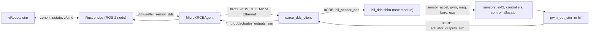

# HITL over uXRCE-DDS: development plan

Status: **proposal, nothing implemented.** Written 2026-09-18 against this fork at PX4 v1.17.0.

Goal: run hardware-in-the-loop (HITL) on an FMUv5 or FMUv6X against the Ubicoders vRobots
simulator, with the sensor and motor loop carried by **uXRCE-DDS (ROS 2)** instead of MAVLink.
PX4 must use the simulator's IMU, magnetometer, barometer and GNSS, run EKF2 and the full
control cascade unchanged, and return motor outputs to the PC.

Companion picture-first explainer: [bridge_explainer.html](bridge_explainer.html).

## 1. Background

### 1.1 The simulator

SDK repository on the development machine:
`/mnt/A4CC6455CC6423B0/Github/ubicoders_products/vrobots/vrobots_sdk`
(relative to this repository root: `../ubicoders_products/vrobots/vrobots_sdk`).

| Path in the SDK repo | Contents |
|---|---|
| `book/core/` | The SDK book. Start with `introduction.md`, then `ch02-concepts/06-five-rules.md` and `ch02-concepts/07-frames-and-units.md`. |
| `book/core/ch04-commands/02-multirotor.md`, `book/core/ch07-robots/01-multirotor.md` | The multirotor command interface, thrust curves and known simulator bugs. |
| `examples/python/` | 36 runnable examples. `ex02_hello_control.py` (PWM), `ex10_sensors_tour.py` (every state field), `ex35_publish_estimate.py`, `ex36_rotations.py`. |
| `examples/rust/src/bin/` | The same examples in Rust, the language planned for the bridge. |
| `crates/vrobots-sdk/` | The Rust core crate the bridge will depend on. |

Python environment: conda env `vrobots` (`conda run -n vrobots vrobots topic list` shows the live
topics; the subcommand is `topic`, singular).

- Unity simulator, driven through `vrobots_sdk` (Rust core, Python and C++ bindings).
  State, commands and services use zenoh; cameras use iceoryx2; payloads are FlatBuffers.
- State is published at about 50 Hz (`vrobots/<sys_id>/z/state`). This is a hard limit.
- The multirotor has **no onboard controller and no mixer**. The only working command is
  `SET_MR_PWM`: four pulse widths, 1100 to 2000 microseconds. This matches the level at which
  PX4 outputs.
- The multirotor publishes in `frd`. Quaternions are `[x, y, z, w]`. Pose is world frame, twist
  is body frame. A multirotor created through `srv/create` has frozen dynamics in simulator
  v3.0.0, so always attach to the scene-authored one by `sys_id`.

### 1.2 How stock HITL works in PX4

HITL has two independent halves.

| Half | Trigger | What it does | Reference |
|---|---|---|---|
| Boot | `SYS_HITL=1` | `sensors start -h`, GPS disabled, board sensor drivers **not started** | [rcS:324](../../ROMFS/px4fmu_common/init.d/rcS#L324) |
| Boot | `SYS_HITL=1` | `commander start -h`, `pwm_out_sim start -m hil` replaces `pwm_out` and `dshot` | [rcS:466](../../ROMFS/px4fmu_common/init.d/rcS#L466) |
| Ingestion | `HIL_SENSOR`, `HIL_GPS` over MAVLink | Publishes virtual sensors through `PX4Gyroscope`, `PX4Accelerometer`, `PX4Magnetometer`, `sensor_baro`, `sensor_gps` | [mavlink_receiver.cpp:2333](../../src/modules/mavlink/mavlink_receiver.cpp#L2333) |
| Output | `HIL_ACTUATOR_CONTROLS` stream | Reads uORB `actuator_outputs_sim`, published by `pwm_out_sim` | [HIL_ACTUATOR_CONTROLS.hpp:60](../../src/modules/mavlink/streams/HIL_ACTUATOR_CONTROLS.hpp#L60) |

EKF2 and the controllers read uORB only. They cannot tell which module published the sensor
topics. The boot half is transport independent and needs no change.

### 1.3 Why stock uXRCE-DDS cannot do it

[dds_topics.yaml](../../src/modules/uxrce_dds_client/dds_topics.yaml) has no inbound
`sensor_accel`, `sensor_gyro`, `sensor_mag`, `sensor_baro` or `sensor_gps`, and no outbound
`actuator_outputs_sim`. With `SYS_HITL=0` and only DDS connected, EKF2 uses the real hardware
sensors.

Reminder on the transport: PX4 runs the XRCE-DDS **client** (`uxrce_dds_client`). It can only
talk to the **MicroXRCEAgent**, a standalone eProsima program on the PC, which converts XRCE-DDS
to full DDS. ROS 2 nodes then see `/fmu/in/*` and `/fmu/out/*`. The bridge never addresses the
Agent; it only publishes and subscribes to ROS 2 topics.

## 2. Design

Replace only the ingestion half with a DDS-fed publisher, and export the existing output topic.

### 2.1 Options considered

| Option | Change | Verdict |
|---|---|---|
| 1. YAML only | Subscribe the five raw sensor topics, publish `actuator_outputs_sim` | Rejected. The PC would have to fill PX4-internal fields (`device_id`, `samples`, `clip_counter`, `error_count`) and supply timestamps valid in PX4's clock. Wrong timestamps make EKF2 reject data silently. |
| 2. Custom message plus shim module | One new message, one small module, two YAML entries | **Chosen.** Timestamps are taken with `hrt_absolute_time()` on arrival and device ids are fixed in the module, exactly as the MAVLink handler does. |

### 2.2 Firmware changes (Option 2)

1. **New message** `msg/HilSensorDds.msg`: `timestamp`, `gyro_rad[3]`, `accel_m_s2[3]`,
   `mag_ga[3]`, `baro_pressure_pa`, `baro_temp_c`, a `fields_updated` bitmask, and optional GNSS
   fields (`lat`, `lon`, `alt`, `vel_ned[3]`, `eph`, `epv`, `fix_type`, `satellites_used`).
   A separate `HilGpsDds.msg` is acceptable if one message becomes unwieldy.
2. **New module** `src/modules/hil_dds/`: subscribes to `hil_sensor_dds` and republishes using
   the same calls as `handle_message_hil_sensor` and `handle_message_hil_gps`. About 150 lines.
   It publishes to uORB, so it is transport independent and also works with the native
   [zenoh module](../../src/modules/zenoh) if `rmw_zenoh` is adopted later.
3. **`dds_topics.yaml`**: add `/fmu/in/hil_sensor_dds` under `subscriptions` and
   `/fmu/out/actuator_outputs_sim` (type `px4_msgs::msg::ActuatorOutputs`) under `publications`.
4. **Startup**: start `hil_dds` when `SYS_HITL` is greater than 0. Either one line in `rcS`, or
   an SD-card `etc/extras.txt` so that `rcS` stays untouched.
5. **Board config**: enable the module in `boards/px4/fmu-v6x/default.px4board` and the FMUv5
   equivalent.

### 2.3 PC side

- Regenerate `px4_msgs` from this branch so the new message type exists in ROS 2.
- Rust bridge as a ROS 2 node (`r2r` recommended): read `vrobots_sdk` state paced by
  `wait_new_state`, publish `/fmu/in/hil_sensor_dds`, subscribe `/fmu/out/actuator_outputs_sim`
  with **best-effort** QoS, map outputs to `1100 + 900 * u` microseconds, call `set_mr_pwm`.
- Conversions: pressure stays in Pa in the custom message (convert inside the shim as needed),
  GNSS scaled as the shim expects, accelerometer z must read about -9.81 m/s^2 at rest,
  quaternion reorder `[x, y, z, w]` to `[w, x, y, z]` wherever attitude is sent.
- Motor map: a fixed table from PX4 quad-X motor order to simulator rotor indices, found once by
  bumping each rotor and observing the body rate. Spin directions must match.
- Safety: the simulator has no watchdog and commands latch. Send `[1100; 4]` on disarm, on
  topic timeout and on exit.

### 2.4 Parameters

- `SYS_HITL=1`, a quadrotor airframe, reboot.
- `UXRCE_DDS_CFG` on TELEM2 (serial, 921600 baud) or Ethernet on FMUv6X. USB can stay on MAVLink
  for QGroundControl at the same time.
- 50 Hz tuning, starting values to verify on the bench: `IMU_INTEG_RATE=50`, lower
  `IMU_GYRO_RATEMAX`, `IMU_GYRO_CUTOFF` and `IMU_DGYRO_CUTOFF` near 15 to 20 Hz, reduced
  `MC_ROLLRATE_P`, `MC_PITCHRATE_P` and D terms. Do not repeat samples to fake a higher rate.
- `CA_ROTOR*` geometry and hover thrust matched to the simulator airframe.

## 3. Phases

| Phase | Work | Exit criterion |
|---|---|---|
| 0. Baseline | Rust bridge over **stock MAVLink HIL** (no firmware change). Find motor map, mass, hover PWM. | EKF2 converges, vehicle arms and hovers in Position mode. |
| 1. Firmware | New branch, message, shim, YAML entries, board config. Build both boards. | `listener sensor_accel` shows simulator data with `SYS_HITL=1` and no MAVLink HIL traffic. |
| 2. Bridge adapter | Add the ROS 2 adapter to the same bridge core. | `actuator_outputs_sim` reaches `set_mr_pwm`; hover matches Phase 0. |
| 3. Companion rehearsal | Add `/fmu/in/vehicle_visual_odometry` from simulator truth and `/fmu/in/trajectory_setpoint`. | Offboard flight with EV fusion, matching the IPS configuration. |

Phase 0 is recommended first because it isolates simulator and tuning problems from firmware
problems, and the bridge core is reused unchanged.

## 4. Risks

1. **50 Hz sensor rate.** Workable, but gains must be soft. A simulator limit, not a transport
   limit.
2. **Fork maintenance.** This is a firmware change and conflicts with the Phase 1 params-only
   rule. Keep it on its own branch, for example `ubicoders_hil_dds_v1.17.0`, based on
   `ubicoders_example_v1.17.0`, which already carries custom DDS message scaffolding.
3. **`px4_msgs` mismatch.** Definitions must match the firmware exactly. A mismatch shows topics
   with no data.
4. **Best-effort delivery and Agent latency.** Occasional lost samples are possible, as with
   MAVLink over USB. Bandwidth is not a concern: about 100 bytes at 50 Hz.
5. **Duplicate inputs.** Do not send the same data over both MAVLink and DDS (for example EV
   odometry), or EKF2 receives duplicate samples.
6. **`rmw_zenoh`.** The Agent outputs DDS, which `rmw_zenoh` nodes do not see. Stay on a DDS
   middleware, or move to PX4's native zenoh module (FMUv6X only, experimental in v1.17).

## 5. Open questions

- Simulator multirotor mass, inertia and rotor layout are undocumented; measure in Phase 0.
- Sign convention of the simulator accelerometer at rest.
- Whether the uXRCE-DDS client's timesync is needed at all once the shim stamps on arrival
  (expected: no).
