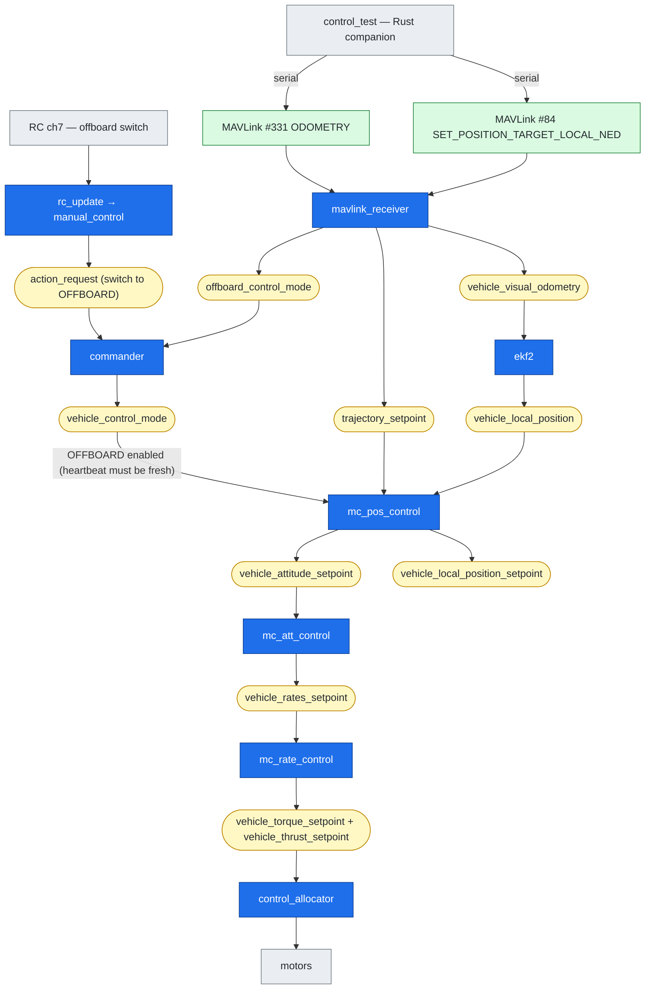
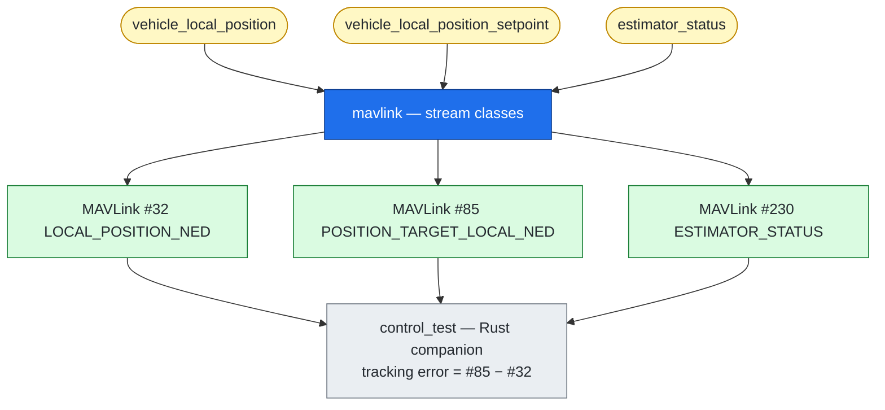

# odom.md — ODOMETRY data path: Rust companion ⇄ PX4

How the IPS state and the offboard setpoint travel from the Rust companion
(`ips_onboard_px4/src/control_test.rs`) **into** PX4, through its stock modules and
uORB topics, out to the motors, and **back** as the MAVLink readback the Rust app
prints. Every module / topic / message below is named and cited to the v1.17
firmware in this tree so it can be verified.

Phase 1 uses **only built-in PX4 modules** and the stock MAVLink `common` dialect —
no firmware changes. The companion just speaks MAVLink over `/dev/ttyACM0`.

---

## Legend — three kinds of thing

| In the diagrams | Is a… | Lives on |
|---|---|---|
| `┌─ name ─┐` **boxed** / blue node | **PX4 module** (a task that subscribes topics, publishes topics) | inside PX4 |
| `uORB: topic` / yellow rounded node | **uORB topic** (PX4's internal in-RAM pub/sub bus) | inside PX4 |
| `MAVLink #NNN` / green node | **MAVLink message** (numbered, on the serial wire) | Rust ⇄ PX4 wire |
| grey node | companion app, the RC pilot, or the motors | outside the flow |

Three things flow: **STATE** (where the vehicle is), **SETPOINT** (where it should
go), and **READBACK** (what PX4 reports so the companion can see the error).

---

## ASCII view (split by stage; every arrow is tagged)

### A. Inbound STATE — IPS estimate → PX4's fused estimate

```
   control_test  (Rust companion)
        |
        |  MAVLink #331  ODOMETRY                 (IPS pos + vel)
        v
   +----------------------+
   |   mavlink_receiver   |   module: decode MAVLink -> uORB
   +----------------------+
        |
        |  uORB: vehicle_visual_odometry          (the EKF's external-vision input)
        v
   +----------------------+
   |        ekf2          |   module: fuse external vision -> state estimate
   +----------------------+
        |
        |  uORB: vehicle_local_position           (the fused state everything trusts)
        v
   +----------------------+
   |    mc_pos_control    |   (continues in stage C)
   +----------------------+
```

### B. Inbound SETPOINT + MODE — the offboard target and its heartbeat

```
   control_test  (Rust companion)
        |
        |  MAVLink #84  SET_POSITION_TARGET_LOCAL_NED     (target; also the heartbeat)
        v
   +----------------------+
   |   mavlink_receiver   |
   +----------------------+
        |                                  |
        |  uORB:                           |  uORB:
        |  trajectory_setpoint             |  offboard_control_mode
        v                                  v
   +----------------------+        +----------------------+
   |    mc_pos_control    |        |      commander       |  permits OFFBOARD; pilot ENTERS via RC ch7 (§3)
   +----------------------+        +----------------------+   (needs the heartbeat
                                                               < COM_OF_LOSS_T, 1 s)
```

### C. CONTROL cascade — setpoint + estimate → motors (all stock modules)

```
   +----------------------+
   |    mc_pos_control    |   position -> attitude setpoint
   +----------------------+
        |
        |  uORB: vehicle_attitude_setpoint
        |  uORB: vehicle_local_position_setpoint   (the CONSTRAINED sp -> readback #85)
        v
   +----------------------+
   |    mc_att_control    |   attitude -> rate setpoint
   +----------------------+
        |
        |  uORB: vehicle_rates_setpoint
        v
   +----------------------+
   |    mc_rate_control   |   rate -> torque/thrust
   +----------------------+
        |
        |  uORB: vehicle_torque_setpoint + vehicle_thrust_setpoint
        v
   +----------------------+
   |   control_allocator  |   -> uORB: actuator_motors -> MOTORS
   +----------------------+
```

### D. Outbound READBACK — PX4 streams state/setpoint/health back to Rust

```
   uORB topics produced above:
     vehicle_local_position            (from ekf2)
     vehicle_local_position_setpoint   (from mc_pos_control)
     estimator_status                  (from ekf2)
        |
        v
   +----------------------+
   |   mavlink (streams)  |   module: read uORB -> emit MAVLink
   +----------------------+
        |
        |  MAVLink #32   LOCAL_POSITION_NED          <- vehicle_local_position
        |  MAVLink #85   POSITION_TARGET_LOCAL_NED   <- vehicle_local_position_setpoint
        |  MAVLink #230  ESTIMATOR_STATUS            <- estimator_status
        v
   control_test  (Rust companion)        tracking error = #85 - #32
```

---

## Flowchart view (color-coded; topics are nodes)

> Node colors: **blue = PX4 module**, **yellow (rounded) = uORB topic**,
> **green = MAVLink message on the wire**, **grey = companion / motors**.

### Inbound + control



### Outbound readback



---

## 1. Inbound STATE — IPS position/velocity becomes PX4's estimate

| Step | Module | In | Out (uORB) | Where |
|---|---|---|---|---|
| 1 | **control_test** (Rust) | IPS pos+vel (room-FRD, tagged `MAV_FRAME_LOCAL_NED`) | — sends **`ODOMETRY` #331** | `control_test.rs` `odometry()` |
| 2 | **mavlink_receiver** | `ODOMETRY #331` | **`vehicle_visual_odometry`** | `handle_message_odometry()` → `_visual_odometry_pub` ([mavlink_receiver.cpp:1349](src/modules/mavlink/mavlink_receiver.cpp#L1349), pub [:1541](src/modules/mavlink/mavlink_receiver.cpp#L1541); decl [mavlink_receiver.h:329](src/modules/mavlink/mavlink_receiver.h#L329)) |
| 3 | **ekf2** | `vehicle_visual_odometry` (+IMU/baro) | **`vehicle_local_position`**, `estimator_status`, `vehicle_attitude` | sub [EKF2.hpp:330](src/modules/ekf2/EKF2.hpp#L330); pub [EKF2.hpp:439](src/modules/ekf2/EKF2.hpp#L439) |

- **mavlink_receiver** — the MAVLink **ingest** task: decode each inbound message,
  republish onto the matching uORB topic. `ODOMETRY` → **`vehicle_visual_odometry`**
  (the EKF's external-vision input bus).
- **ekf2** — the state **estimator**: fuses external vision with IMU/baro into the
  fused **`vehicle_local_position`**. Acceptance depends on params + yaw alignment —
  see [§6](#6-gotcha-it-only-works-once-yaw-is-aligned).

## 2. Inbound SETPOINT — the offboard target (and the heartbeat)

| Step | Module | In | Out (uORB) | Where |
|---|---|---|---|---|
| 4 | **control_test** (Rust) | desired position | — sends **`SET_POSITION_TARGET_LOCAL_NED` #84** | `control_test.rs` `set_position_target()` |
| 5 | **mavlink_receiver** | `#84` | **`trajectory_setpoint`** + **`offboard_control_mode`** | `handle_message_set_position_target_local_ned()` ([mavlink_receiver.cpp:1034](src/modules/mavlink/mavlink_receiver.cpp#L1034); pubs [:101](src/modules/mavlink/mavlink_receiver.cpp#L101) & [:109](src/modules/mavlink/mavlink_receiver.cpp#L109)) |
| 6 | **commander** | `offboard_control_mode` freshness | permits **OFFBOARD** | needs it faster than `COM_OF_LOSS_T` (default 1 s) |

- **`trajectory_setpoint`** = *what to do* (go to `[3, 0, -1.5]`).
- **`offboard_control_mode`** = the *heartbeat / capability flag* telling **commander**
  a companion is actively in control. There is **no** separate `OFFBOARD_CONTROL_MODE`
  MAVLink message in `common`; streaming `#84` fast enough *is* the heartbeat.
- The heartbeat only makes OFFBOARD **available**. **Entering** it is a *separate*
  command the companion does **not** send — the pilot flips **RC channel 7** (or a GCS
  sends `DO_SET_MODE`). See [§3](#3-entering-offboard-the-rc-mode-switch-channel-7).

## 3. Entering OFFBOARD: the RC mode switch (channel 7)

§2's heartbeat only makes OFFBOARD **available**; something still has to **command entry
into** it. The companion (`control_test`) never does — it sends no `DO_SET_MODE` and no
arm command. On the bench/in flight, **RC channel 7** is that trigger (a 2-position
switch: *down* = manual/position, *up* = OFFBOARD); a GCS `MAV_CMD_DO_SET_MODE` is the
alternative. This is the **control-plane** path — orthogonal to the per-frame data
pipeline of §1–§2 — and it converges on `commander`.

```
   RC transmitter, channel 7   (down = manual ·· up = OFFBOARD)
        |  raw frame → uORB: input_rc
        v
   +----------------------+
   |      rc_update       |  RC_MAP_OFFB_SW=7 → FUNCTION_OFFBOARD; threshold ch7
   +----------------------+
        |  uORB: manual_control_switches   (.offboard_switch = ON / OFF)
        v
   +----------------------+
   |    manual_control    |  edge ON → ACTION_SWITCH_MODE(OFFBOARD); OFF → mode slot
   +----------------------+
        |  uORB: action_request
        v
   +----------------------+
   |      commander       |  validate (needs fresh heartbeat) + flip nav_state
   +----------------------+
        |  uORB: vehicle_status        (.nav_state = NAVIGATION_STATE_OFFBOARD)
        |  uORB: vehicle_control_mode  (.flag_control_offboard_enabled = true)
        v
   unlocks mc_pos_control to act on trajectory_setpoint
```

| Hop | Module | In | Out (uORB) | Where |
|---|---|---|---|---|
| a | **rc_update** | `input_rc` (ch7 raw) | **`manual_control_switches`** (`.offboard_switch`) | `RC_MAP_OFFB_SW`→`FUNCTION_OFFBOARD` [rc_update.cpp:200](src/modules/rc_update/rc_update.cpp#L200); threshold [:622](src/modules/rc_update/rc_update.cpp#L622) |
| b | **manual_control** | `manual_control_switches` | **`action_request`** (`ACTION_SWITCH_MODE` → `OFFBOARD`) | edge [ManualControl.cpp:221](src/modules/manual_control/ManualControl.cpp#L221); publish [:446](src/modules/manual_control/ManualControl.cpp#L446) |
| c | **commander** | `action_request` | **`vehicle_status`** + **`vehicle_control_mode`** | consume [Commander.cpp:1904](src/modules/commander/Commander.cpp#L1904); intent [:1723](src/modules/commander/Commander.cpp#L1723); pubs [:1945](src/modules/commander/Commander.cpp#L1945) & [:2617](src/modules/commander/Commander.cpp#L2617) |

**How it interacts with the companion's `#84` heartbeat.** RC ch7 is the *trigger*; the
heartbeat (`offboard_control_mode`, regenerated by every `#84` — §2) is the *precondition*
commander checks before it will **grant or hold** OFFBOARD. Both must hold at once:

| RC channel 7 | companion streaming `#84`? | result |
|---|---|---|
| **up** (request OFFBOARD) | fresh (< `COM_OF_LOSS_T`, 1 s) | commander **enters** `NAVIGATION_STATE_OFFBOARD` |
| **up** | stale / absent | mode switch **rejected** (`printRejectMode`) — can't enter |
| was up, heartbeat then **drops** | — | `offboard_control_signal_lost` → **offboard-loss failsafe** |
| **down** (manual) | — | reverts to the flight-mode slot (manual / position / altitude) |

The freshness + setpoint-bit gate lives in **OffboardChecks**
([offboardCheck.cpp:40](src/modules/commander/HealthAndArmingChecks/checks/offboardCheck.cpp#L40));
OFFBOARD is marked as *requiring* it in
[mode_requirements.cpp:158](src/modules/commander/ModeUtil/mode_requirements.cpp#L158).

Two more notes:

- **Switch variants.** A *dedicated* offboard switch is `RC_MAP_OFFB_SW=7`. If instead
  ch7 is the *flight-mode selector* (`RC_MAP_FLTMODE=7` with one `COM_FLTMODE1..6` slot
  set to Offboard), it arrives as `manual_control_switches.mode_slot`
  ([rc_update.cpp:564](src/modules/rc_update/rc_update.cpp#L564)) →
  `ManualControl::evaluateModeSlot` → the **same** `action_request` → commander path.
  Either way the modules and the heartbeat gate are identical.
- **Setpoints don't act until entry.** mavlink_receiver only republishes
  `trajectory_setpoint` once `nav_state` is *already* OFFBOARD
  ([mavlink_receiver.cpp:1139](src/modules/mavlink/mavlink_receiver.cpp#L1139)). So before
  ch7 is flipped up, the companion's `#84` stream only keeps the heartbeat alive;
  mc_pos_control acts on the setpoints only after commander has entered OFFBOARD.

## 4. Control chain — setpoint + estimate → motors (all stock modules)

| Step | Module | Subscribes | Publishes (uORB) | Where |
|---|---|---|---|---|
| 7 | **mc_pos_control** | `trajectory_setpoint`, `vehicle_local_position` | **`vehicle_attitude_setpoint`** + **`vehicle_local_position_setpoint`** (*constrained* sp) | attitude sp [MulticopterPositionControl.cpp:47](src/modules/mc_pos_control/MulticopterPositionControl.cpp#L47); local-pos sp [:606](src/modules/mc_pos_control/MulticopterPositionControl.cpp#L606) |
| 8 | **mc_att_control** | `vehicle_attitude_setpoint`, `vehicle_attitude` | **`vehicle_rates_setpoint`** | [mc_att_control_main.cpp:365](src/modules/mc_att_control/mc_att_control_main.cpp#L365) |
| 9 | **mc_rate_control** | `vehicle_rates_setpoint` | **`vehicle_torque_setpoint`** + **`vehicle_thrust_setpoint`** | [MulticopterRateControl.cpp:49](src/modules/mc_rate_control/MulticopterRateControl.cpp#L49), pub [:264](src/modules/mc_rate_control/MulticopterRateControl.cpp#L264) |
| 10 | **control_allocator** | torque/thrust sp | `actuator_motors` → ESCs/motors | — |

The classic PX4 cascade: **position → attitude → rate → torque/thrust → motors**.
Phase 1 touches *none* of it — the companion feeds the two inputs at the top and
reads the outputs at the bottom. The **`vehicle_local_position_setpoint`** from step
7 is the setpoint *after* PX4's own feasibility/limiting, which is why readback `#85`
can differ from the raw `#84` the companion sent.

## 5. Outbound READBACK — what PX4 streams back to the Rust app

The **mavlink** module's stream classes do the reverse of mavlink_receiver: subscribe
a uORB topic, emit a MAVLink message.

| MAVLink out | Source uORB topic | Meaning | Where |
|---|---|---|---|
| **`LOCAL_POSITION_NED` #32** | **`vehicle_local_position`** | the fused state (ekf2 output) | [streams/LOCAL_POSITION_NED.hpp:58](src/modules/mavlink/streams/LOCAL_POSITION_NED.hpp#L58) |
| **`POSITION_TARGET_LOCAL_NED` #85** | **`vehicle_local_position_setpoint`** | the controller's *constrained* setpoint | [streams/POSITION_TARGET_LOCAL_NED.hpp:58](src/modules/mavlink/streams/POSITION_TARGET_LOCAL_NED.hpp#L58) |
| **`ESTIMATOR_STATUS` #230** | **`estimator_status`** | EV fusion health (innovation ratios + flags) | [streams/ESTIMATOR_STATUS.hpp:60](src/modules/mavlink/streams/ESTIMATOR_STATUS.hpp#L60) |

Back in **control_test**, the loop reads these and prints **error = `#85 − #32`**.

> `#85` and `#230` are **not** in PX4's default USB stream set, so at startup the Rust
> app requests them with `MAV_CMD_SET_MESSAGE_INTERVAL` (#511 inside `COMMAND_LONG`
> #76) — see `set_message_interval()` in `control_test.rs`.

---

## 6. Gotcha: it only works once yaw is aligned

Publishing `vehicle_visual_odometry` is **necessary but not sufficient**. ekf2 will
not fuse EV horizontal position/velocity (NED frame) until
`_control_status.flags.yaw_align` is true, and the only yaw source under the Phase-1
config (`EKF2_EV_CTRL=7` = no EV yaw, `EKF2_GPS_CTRL=0`) is the **magnetometer**. If
no yaw source aligns, ekf2 sits in `CONST_POS_MODE` and `#32` ignores your `ODOMETRY`
even though everything above is wired correctly. (We hit this: a disabled mag,
`CAL_MAG0_PRIO=0`. Run `control_test --check` to read the EV + mag params back.)

A set `CONST_POS_MODE` while the vehicle is **at rest on the ground** is *normal*
(zero-velocity hold) and clears once it moves — not a fault.

---

## One-line summary of the names

- **Ingest:** `mavlink_receiver` — `ODOMETRY #331` → `vehicle_visual_odometry`;
  `SET_POSITION_TARGET #84` → `trajectory_setpoint` + `offboard_control_mode`.
- **Estimate:** `ekf2` — `vehicle_visual_odometry` → `vehicle_local_position`.
- **Control:** `mc_pos_control` → `mc_att_control` → `mc_rate_control` →
  `control_allocator` → `actuator_motors`.
- **Mode entry (control-plane):** RC ch7 → `rc_update` → `manual_control`
  (`manual_control_switches` → `action_request`) → `commander`
  (`vehicle_status.nav_state` = OFFBOARD, gated on a fresh `offboard_control_mode`).
- **Readback:** `mavlink` streams — `vehicle_local_position` → `#32`,
  `vehicle_local_position_setpoint` → `#85`, `estimator_status` → `#230`.
