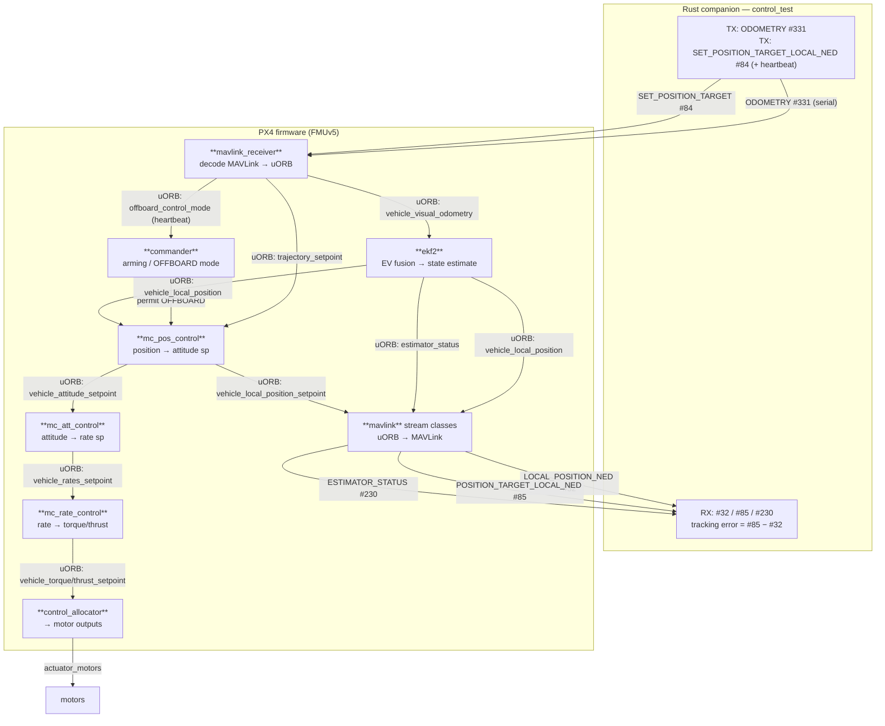

# odom.md — ODOMETRY data path: Rust companion ⇄ PX4

How the IPS state and the offboard setpoint travel from the Rust companion
(`ips_onboard_px4/src/control_test.rs`) **into** PX4, through its stock modules and
uORB topics, out to the motors, and **back** as the MAVLink readback the Rust app
prints. Every module / topic / message below is named and cited to the v1.17
firmware in this tree so it can be verified.

Phase 1 uses **only built-in PX4 modules** and the stock MAVLink `common` dialect —
no firmware changes. The companion just speaks MAVLink over `/dev/ttyACM0`.

---

## Legend

| Notation | Meaning |
|---|---|
| `#NNN` | a **MAVLink** message ID (travels over the serial wire) |
| `topic` | a **uORB** topic (PX4's internal in-RAM pub/sub bus) |
| **Module** | a PX4 work-queue task that subscribes some topics and publishes others |

Three things flow: **STATE** (where the vehicle is), **SETPOINT** (where it should
go), and **READBACK** (what PX4 reports back so the companion can see the error).

---

## End-to-end picture

```
        RUST COMPANION (control_test)                         PX4  (FMUv5)
 ┌──────────────────────────────────┐
 │ ODOMETRY #331  (IPS pos+vel)      │── serial ──▶  mavlink_receiver
 │ SET_POSITION_TARGET #84 (+hb)     │── serial ──▶  mavlink_receiver
 └──────────────────────────────────┘                      │
                                                            │ publishes uORB
                              STATE  ┌─────────────────────┤
                                     ▼                      ▼ SETPOINT
                         vehicle_visual_odometry   trajectory_setpoint
                                     │              offboard_control_mode ─▶ commander
                                     ▼                      │              (enables OFFBOARD)
                                  ekf2  ◀───────────────────┘
                          (EV fusion → estimate)            │
                                     │ vehicle_local_position
                                     ▼                      ▼
                                 mc_pos_control  ◀── trajectory_setpoint
                                     │   │
              vehicle_local_position_setpoint  vehicle_attitude_setpoint
                       (constrained sp)         │
                                     │          ▼
                                     │      mc_att_control
                                     │          │ vehicle_rates_setpoint
                                     │          ▼
                                     │      mc_rate_control
                                     │          │ vehicle_torque/thrust_setpoint
                                     │          ▼
                                     │      control_allocator ─▶ actuator_motors ─▶ MOTORS
                                     │
   ┌─────────────────────────────┐  │   mavlink (stream classes) reads uORB, emits MAVLink:
   │ reads #32, #85, #230         │◀─┴── LOCAL_POSITION_NED #32   ← vehicle_local_position
   │ error = #85 − #32            │◀──── POSITION_TARGET_LOCAL_NED #85 ← vehicle_local_position_setpoint
   └─────────────────────────────┘◀──── ESTIMATOR_STATUS #230   ← estimator_status
```



---

## 1. Inbound STATE — IPS position/velocity becomes PX4's estimate

| Step | Who | In | Out | Where |
|---|---|---|---|---|
| 1 | **control_test** (Rust) | IPS pos+vel (room-FRD, tagged `MAV_FRAME_LOCAL_NED`) | **`ODOMETRY` #331** on serial | `control_test.rs` `odometry()` |
| 2 | **mavlink_receiver** | `ODOMETRY #331` | uORB **`vehicle_visual_odometry`** | `handle_message_odometry()` → `_visual_odometry_pub` ([mavlink_receiver.cpp:1349](src/modules/mavlink/mavlink_receiver.cpp#L1349), pub at [:1541](src/modules/mavlink/mavlink_receiver.cpp#L1541); topic decl [mavlink_receiver.h:329](src/modules/mavlink/mavlink_receiver.h#L329)) |
| 3 | **ekf2** | `vehicle_visual_odometry` (+ IMU, baro…) | uORB **`vehicle_local_position`**, `estimator_status`, `vehicle_attitude` | sub `_ev_odom_sub` ([EKF2.hpp:330](src/modules/ekf2/EKF2.hpp#L330)); pub `_local_position_pub` ([EKF2.hpp:439](src/modules/ekf2/EKF2.hpp#L439)) |

- **mavlink_receiver** — the firmware's MAVLink **ingest** task. It decodes each
  incoming MAVLink message and republishes it onto the matching uORB topic. For
  `ODOMETRY` it fills a `vehicle_odometry` and publishes it to
  **`vehicle_visual_odometry`** (the EKF's external-vision input bus).
- **ekf2** — the state **estimator**. It fuses the external-vision odometry with the
  IMU/baro and produces the vehicle's fused **`vehicle_local_position`** (the number
  the whole control stack trusts). Whether it *accepts* the EV depends on params +
  yaw alignment — see [§5](#5-gotcha-it-only-works-once-yaw-is-aligned).

## 2. Inbound SETPOINT — the offboard target (and the heartbeat)

| Step | Who | In | Out | Where |
|---|---|---|---|---|
| 4 | **control_test** (Rust) | desired position | **`SET_POSITION_TARGET_LOCAL_NED` #84** on serial | `control_test.rs` `set_position_target()` |
| 5 | **mavlink_receiver** | `#84` | uORB **`trajectory_setpoint`** + uORB **`offboard_control_mode`** | `handle_message_set_position_target_local_ned()` ([mavlink_receiver.cpp:1034](src/modules/mavlink/mavlink_receiver.cpp#L1034)); pubs at [:101](src/modules/mavlink/mavlink_receiver.cpp#L101) & [:109](src/modules/mavlink/mavlink_receiver.cpp#L109) |
| 6 | **commander** | `offboard_control_mode` freshness | permits **OFFBOARD** flight mode | needs the message faster than `COM_OF_LOSS_T` (default 1 s) |

- **`trajectory_setpoint`** carries *what to do* (go to position `[3, 0, -1.5]`).
- **`offboard_control_mode`** is the *heartbeat / capability flag* — it tells
  **commander** "a companion is actively commanding me." There is **no** separate
  `OFFBOARD_CONTROL_MODE` MAVLink message in `common`; streaming `#84` fast enough
  *is* the heartbeat (each `#84` regenerates `offboard_control_mode`).

## 3. Control chain — setpoint + estimate → motors (all stock modules)

| Step | Module | Subscribes | Publishes | Where |
|---|---|---|---|---|
| 7 | **mc_pos_control** | `trajectory_setpoint`, `vehicle_local_position` | **`vehicle_attitude_setpoint`** + **`vehicle_local_position_setpoint`** (the *constrained* sp) | attitude sp [MulticopterPositionControl.cpp:47](src/modules/mc_pos_control/MulticopterPositionControl.cpp#L47); local-pos sp pub [:606](src/modules/mc_pos_control/MulticopterPositionControl.cpp#L606) |
| 8 | **mc_att_control** | `vehicle_attitude_setpoint`, `vehicle_attitude` | **`vehicle_rates_setpoint`** | pub [mc_att_control_main.cpp:365](src/modules/mc_att_control/mc_att_control_main.cpp#L365) |
| 9 | **mc_rate_control** | `vehicle_rates_setpoint` | **`vehicle_torque_setpoint`** + **`vehicle_thrust_setpoint`** | [MulticopterRateControl.cpp:49-50](src/modules/mc_rate_control/MulticopterRateControl.cpp#L49), pub [:264](src/modules/mc_rate_control/MulticopterRateControl.cpp#L264) |
| 10 | **control_allocator** | torque/thrust sp | `actuator_motors` → ESCs/motors | — |

The classic PX4 cascade: **position → attitude → rate → torque/thrust → motors**.
Phase 1 touches *none* of it — the companion only feeds the two inputs (state +
setpoint) at the top and reads the outputs at the bottom.

Note the **`vehicle_local_position_setpoint`** that mc_pos_control publishes at
step 7: it is the setpoint *after* PX4's own limiting/feasibility shaping, which is
why the readback `#85` (below) can differ from the raw `#84` the companion sent.

## 4. Outbound READBACK — what PX4 streams back to the Rust app

The **mavlink** module's stream classes do the reverse of mavlink_receiver: they
subscribe uORB topics and emit MAVLink messages on the wire.

| MAVLink out | Source uORB topic | Meaning | Where |
|---|---|---|---|
| **`LOCAL_POSITION_NED` #32** | **`vehicle_local_position`** | the fused state (ekf2 output) | `_lpos_sub` [streams/LOCAL_POSITION_NED.hpp:58](src/modules/mavlink/streams/LOCAL_POSITION_NED.hpp#L58) |
| **`POSITION_TARGET_LOCAL_NED` #85** | **`vehicle_local_position_setpoint`** | the controller's *constrained* setpoint | `_pos_sp_sub` [streams/POSITION_TARGET_LOCAL_NED.hpp:58](src/modules/mavlink/streams/POSITION_TARGET_LOCAL_NED.hpp#L58) |
| **`ESTIMATOR_STATUS` #230** | **`estimator_status`** | EV fusion health (innovation ratios + flags) | `_estimator_status_sub` [streams/ESTIMATOR_STATUS.hpp:60](src/modules/mavlink/streams/ESTIMATOR_STATUS.hpp#L60) |

Back in **control_test**, the loop reads these and prints the **tracking
error = `#85 − #32`** (commanded-constrained minus actual-estimate).

> `#85` and `#230` are **not** in PX4's default USB stream set, so at startup the
> Rust app explicitly requests them with `MAV_CMD_SET_MESSAGE_INTERVAL` (#511 inside
> a `COMMAND_LONG` #76) — see `set_message_interval()` in `control_test.rs`.

---

## 5. Gotcha: it only works once yaw is aligned

Publishing `vehicle_visual_odometry` is **necessary but not sufficient**. ekf2 will
not fuse EV horizontal position/velocity (NED frame) until
`_control_status.flags.yaw_align` is true, and the only yaw source under the Phase-1
config (`EKF2_EV_CTRL=7` = no EV yaw, `EKF2_GPS_CTRL=0`) is the **magnetometer**. If
no yaw source aligns, ekf2 sits in `CONST_POS_MODE` and `#32` ignores your
`ODOMETRY` even though everything above is wired correctly. (We hit this: a disabled
mag, `CAL_MAG0_PRIO=0`. Run `control_test --check` to read the EV + mag params back.)

A set `CONST_POS_MODE` while the vehicle is **at rest on the ground** is *normal*
(zero-velocity hold) and clears once it moves — not a fault.

---

## One-line summary of the names

- **Ingest:** `mavlink_receiver` — `ODOMETRY #331` → `vehicle_visual_odometry`;
  `SET_POSITION_TARGET #84` → `trajectory_setpoint` + `offboard_control_mode`.
- **Estimate:** `ekf2` — `vehicle_visual_odometry` → `vehicle_local_position`.
- **Control:** `mc_pos_control` → `mc_att_control` → `mc_rate_control` →
  `control_allocator` → `actuator_motors`.
- **Readback:** `mavlink` streams — `vehicle_local_position` → `#32`,
  `vehicle_local_position_setpoint` → `#85`, `estimator_status` → `#230`.
